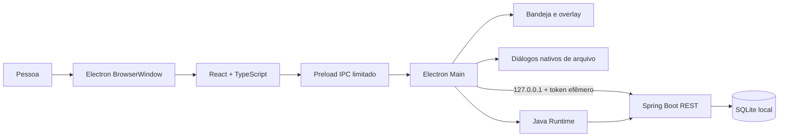

# Arquitetura e segurança

## Componentes

O renderer roda com `contextIsolation`, sandbox e `nodeIntegration=false`; conhece apenas métodos definidos no preload. O token não é renderizado na interface. Electron Main cria token aleatório a cada execução, escolhe uma porta livre empacotada e inicia o JAR. Spring limita o endereço a loopback e valida o token em todas as rotas, exceto health.

## Telas e módulos

| Tela | Componentes | Rotas centrais |
|---|---|---|
| Apontar horas | `FocusPage`, `TimerPanel`, `RetroactiveDialog` | `/api/sessions`, `/api/sessions/retroactive`, `/{id}/tick`, `pause`, `resume`, `finish` |
| Dashboard | `DashboardPage`, `Chart` | `/api/dashboard` |

| Relatórios | `ReportPage`, `SessionDialog`, confirmação de exclusão | `/api/sessions` e `/{id}` (GET, PUT, DELETE) |
| Tarefas | `TasksPage` | `/api/tasks`, `/{id}/complete` |

## Novos campos e atalhos (New 1.1)

- `sessions.category` é persistida pela API de sessões e retroativos; valores aceitos: `Normal` e `Agenda`. Relatórios filtram por categoria e CSV exporta a coluna.
- `tasks.due_date` é uma data opcional. A API serializa como ISO e a lista aplica filtros de prazo sem afetar os totais ou apontamentos.
- `App` recebe atalhos Alt para trocar espaços, iniciar/pausar e encerrar. A sobreposição Electron mostra atividade e relógio lado a lado.
- O backend migra bancos antigos com `ALTER TABLE` apenas para campos novos ausentes. Stable e New mantêm `%APPDATA%/foco-java/data/foco.db`; o bloqueio de instância compartilhado impede abrir as duas simultaneamente.
| Configurações | `SettingsPage` | `/api/settings`, `/api/settings/colors`, `/api/import/v35`, `/api/backup` |
| Sobreposição | `overlay.tsx` | eventos de timer enviados pela janela principal |

O agregado do dashboard informa `client` quando todas as sessões de um grupo pertencem ao mesmo cliente; grupos com clientes diferentes omitem essa associação. O renderer usa esse dado e as cores carregadas por `/api/settings/colors` para marcar projetos sem atribuir a cor de um cliente a outro. `fillSuggestions.ts` extrai valores locais para autocomplete independente nos três formulários, sem nova rota de rede. `accent.ts` escolhe texto claro ou escuro para botões com base na luminosidade da cor configurada.

## Processo de inicialização

1. O Electron impede uma segunda instância e localiza diretório de dados.
2. Cria porta loopback livre (empacotado), token randômico e processo Java.
3. Espera `/api/health`; Spring cria banco/schema e recupera sessão ativa como pausada.
4. Carrega interface, ícone de bandeja e handlers IPC.
5. No encerramento explícito, termina apenas o subprocesso Java desta fork. Fechar janela oculta na bandeja.

## Limites e validação

- XML importado: limite de 128 MB por arquivo, quantidade máxima de itens, validação de campos e DTD/entidades externas desativadas.
- SQLite: valores de domínio validados em controllers, parâmetros JDBC vinculados, relação tarefa/sessão com FK.
- Lançamento retroativo: o renderer avisa sobre intervalos que se cruzam; o endpoint valida datas passadas, duração efetiva, estado final e tarefa existente, e permite a sobreposição confirmada pela pessoa.
- Backup: snapshot consistente SQLite com `VACUUM INTO`, ZIP conferido antes de publicar e sem remoção de cópias antigas.
- CSV: campos entre aspas e prefixo apóstrofo para conteúdos iniciados por `=`, `+`, `-` ou `@`.
- Links externos abrem somente HTTPS pelo Electron Main; outras janelas são recusadas.

## Endpoints

| Verbo | Rota | Efeito |
|---|---|---|
| GET | `/api/health` | Verificação local pública |
| GET/POST | `/api/sessions` | Lista filtrada/cria sessão |
| POST | `/api/sessions/retroactive` | Cria apontamento finalizado com foco efetivo e tarefa opcional |
| POST | `/api/sessions/{id}/tick`, `/pause`, `/resume`, `/finish` | Controla cronômetro |
| PUT | `/api/sessions/{id}` | Corrige histórico |
| DELETE | `/api/sessions/{id}` | Exclui um lançamento finalizado; recusa ativo ou pausado |
| GET | `/api/sessions/export.csv` | CSV protegido contra fórmulas |
| GET/POST/PUT/DELETE | `/api/tasks` | Consulta e mantém tarefas |
| GET | `/api/dashboard` | Agregados e subtotais |
| GET/PUT | `/api/settings` | Preferências |
| GET/PUT/DELETE | `/api/settings/colors` | Cores de cliente |
| POST | `/api/import/v35` | Migração inicial idempotente |
| POST | `/api/backup` | Snapshot manual ou diário |
