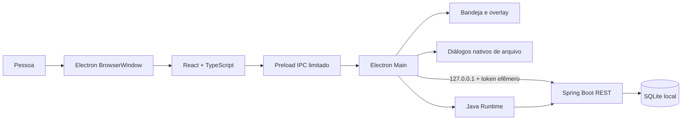
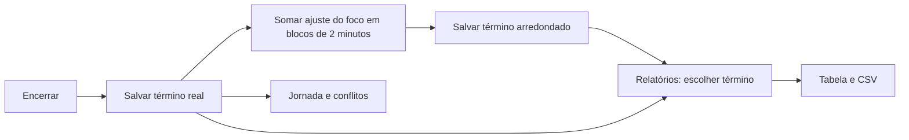

# Arquitetura e segurança

## New 1.17.0 — interface e conversão do foco

`experience.css` centraliza superfícies, relevo, contraste e movimento; `App` usa entrada por rota e foco no título; `TimerPanel` anima o indicador ativo. `prefers-reduced-motion` e impressão desativam animações.

`FocusRounding` usa blocos de 120 segundos. `RoundingMigration`, chamada após adicionar `rounding_version`, adquire a manutenção exclusiva, cria backup e converte o histórico recuperável em transação com auditoria. `LocalRestore` usa a mesma conversão na transação de restauração. A API mantém ausência de precisão histórica; nenhum novo transporte ou serviço externo. Contratos e diagrama em [Interface e arredondamento](Interface-e-arredondamento.md).

## Sétima onda — New 1.16.0

Jornada passa a resolver versões semanais por vigência e exceções por data. `ScheduleRepository.resolver()` lê uma fotografia das regras por consulta; a mesma resolução alimenta lacunas e meta do extra-time. Datas anteriores a uma nova regra conservam a apuração legada. A linha do tempo é derivada de sessões/intervalos já carregados, cortados nos limites do dia local, sem gravar tempos ou inventar pausas de legados. Trocas de dia atualizam lacunas; respostas antigas da Jornada são descartadas.

O preload acrescenta apenas `chooseBackup`, um diálogo de arquivo ZIP. `/api/backup/preview` copia o ZIP para um temporário privado, calcula seu SHA-256, lê somente banco/manifesto e verifica integridade, vínculos, esquema e preferências. Uma importação em banco temporário com o esquema atual verifica restrições antes da prévia. `/api/backup/restore` exige confirmação e o mesmo hash, revalida tudo, bloqueia sessões atuais abertas, cria cópia anterior e importa tabelas em uma única transação. Falhas desfazem os dados importados; a cópia anterior permanece disponível. Nenhum arquivo do banco em uso é substituído enquanto aberto.

`DatabaseMaintenance` usa um bloqueio de leitura/escrita justo: requisições autenticadas e backup automático usam leitura; a restauração usa escrita exclusiva, aguardando operações existentes e impedindo gravações entre cópia de segurança e commit. Saúde pública não acessa dados. Depois do commit, Electron reaplica preferências restauradas de atalho/lembretes; a interface é recarregada ao concluir o diálogo. Detalhes e diagrama em [Sétima onda](Setima-onda.md).

## Sexta onda — New 1.15.0

`local-workflow.cjs` controla atalho global e lembretes no processo principal, com dependências e relógio injetáveis para testes. O Electron lê preferências pela API autenticada ao iniciar e reaplica após PUT de `settings`. O preload expõe consultas/ações de lembretes e eventos de navegação, sem expor o token ou APIs nativas genéricas. O atalho é liberado ao encerrar; notificações e bandeja navegam para captura, Hoje ou fechamento. Captura global usa um diálogo próprio sobre o formulário existente. O diálogo recebe foco após `showModal` e devolve foco ao fechar.

O estado diário dos avisos, adiamentos e silêncio é persistido por arquivo temporário + renomeação em `workflow-reminders.json`. Na virada local do dia, o estado é reiniciado. Um aviso novo só é emitido na janela de até 15 minutos após o horário; não se acumula por dias perdidos. As preferências são validadas antes de qualquer escrita, e PUT de `settings` agora é transacional.

Visões versionadas ficam no `localStorage` do perfil Electron, com validação de estrutura, campos, datas, enumerações e limite de 25 por tela. Períodos relativos são recalculados ao aplicar. A API de datas de planejamento, `PUT /api/planning/plans/{id}/date`, preserva os demais campos e grava o histórico na mesma transação; não altera prazo/estado nem horas. O Dashboard retorna `comparison` com as duas bases sobre os mesmos registros selecionados, inclusive os filtros de horas da base aplicada. Respostas antigas de consultas concorrentes não substituem consultas mais recentes no Dashboard/Relatórios.

## Distribuição Stable 1.14.0

A Stable incorpora a implementação atual da New 1.14.0, mantendo identidade Windows `br.com.foco.desktop`, nome `Foco Stable` e instalação assistida. Ambos os canais incluem o gancho NSIS que libera Electron e Java somente da pasta de destino. O banco, o bloqueio compartilhado e a comunicação pelo preload com Spring em loopback/token permanecem como descritos abaixo. Código e instalador são publicados com a mesma tag `v1.14.0-stable`; dados, backups e evidências de uso locais são excluídos do Git.

O Dashboard aceita `hoursMode=rounded|real`; o tempo selecionado por sessão alimenta filtros, totais e agrupamentos na mesma consulta. Sem migração ou alteração do histórico. Contrato, precisão e fluxo em [Horas do Dashboard](Horas-do-dashboard.md).

## Catálogos de nomes

`CatalogService` centraliza leitura, normalização, migração legada, validação e alterações dos catálogos. `CatalogController` publica `/api/catalogs`; as APIs de sessão, tarefa, retroativo e cor consultam o mesmo serviço antes de persistir. A migração de inicialização importa nomes atuais e normaliza diferenças simples. A importação V35 reconcilia os valores após importar sessões, tarefas e cores.

`CatalogsPage` apresenta as três listas independentes e sugestões de nomes próximos. Os formulários usam `CatalogSelect`; assim, uma escolha preenchida sempre corresponde a uma opção válida. Renomear/unificar atualiza os campos textuais históricos dentro de transação. A tabela antiga de cores por cliente continua funcionando: a cor do alvo permanece em uma unificação quando já existe; caso contrário, a cor de origem acompanha o nome canônico.

## Componentes

O renderer roda com `contextIsolation`, sandbox e `nodeIntegration=false`; conhece apenas métodos definidos no preload. O token não é renderizado na interface. Electron Main cria token aleatório a cada execução, escolhe uma porta livre empacotada e inicia o JAR. Spring limita o endereço a loopback e valida o token em todas as rotas, exceto health.

## Telas e módulos

| Tela | Componentes | Rotas centrais |
|---|---|---|
| Apontar horas | `FocusPage`, `TimerPanel`, `RetroactiveDialog` | `/api/sessions`, `/api/sessions/retroactive`, `/{id}/tick`, `pause`, `resume`, `finish` |
| Dashboard | `DashboardPage`, `Chart` | `/api/dashboard` |
| Relatórios | `ReportPage`, `SessionDialog`, confirmação de exclusão | `/api/sessions` e `/{id}` (GET, PUT, DELETE) |
| Jornada | `WorkHoursPage`, `WorkHoursSummary` | `/api/work-hours?from&to` |
| Tarefas | `TasksPage` | `/api/tasks`, `/{id}/complete` |

## Novos campos e atalhos (New 1.1)

- `sessions.category` é persistida pela API de sessões e retroativos; valores aceitos: `Normal` e `Agenda`. Relatórios filtram por categoria e CSV exporta a coluna.
- `tasks.due_date` é uma data opcional. A API serializa como ISO e a lista aplica filtros de prazo sem afetar os totais ou apontamentos.
- `App` recebe atalhos Alt para trocar espaços, iniciar/pausar e encerrar. A sobreposição Electron mostra atividade e relógio lado a lado.
- O backend migra bancos antigos com `ALTER TABLE` apenas para campos novos ausentes. Stable e New mantêm `%APPDATA%/foco-java/data/foco.db`; o bloqueio de instância compartilhado impede abrir as duas simultaneamente.
| Configurações | `SettingsPage` | `/api/settings`, `/api/settings/colors`, `/api/import/v35`, `/api/backup` |
| Sobreposição | `overlay.tsx` | eventos de timer enviados pela janela principal |

O agregado do dashboard informa `client` quando todas as sessões de um grupo pertencem ao mesmo cliente; grupos com clientes diferentes omitem essa associação. O renderer usa esse dado e as cores carregadas por `/api/settings/colors` para marcar projetos sem atribuir a cor de um cliente a outro. `fillSuggestions.ts` extrai valores locais para autocomplete independente nos três formulários, sem nova rota de rede. `accent.ts` escolhe texto claro ou escuro para botões com base na luminosidade da cor configurada.

## Processo de inicialização

1. O Electron impede uma segunda instância e localiza diretório de dados.
2. Cria porta loopback livre (empacotado), token randômico e processo Java.
3. Espera `/api/health`; Spring cria banco/schema e recupera sessão ativa como pausada.
4. Carrega interface, ícone de bandeja e handlers IPC.
5. No encerramento explícito, termina apenas o subprocesso Java desta fork. Fechar janela oculta na bandeja.

## Limites e validação

- XML importado: limite de 128 MB por arquivo, quantidade máxima de itens, validação de campos e DTD/entidades externas desativadas.
- SQLite: valores de domínio validados em controllers, parâmetros JDBC vinculados, relação tarefa/sessão com FK.
- Lançamento retroativo: o renderer avisa sobre intervalos que se cruzam; o endpoint valida datas passadas, duração efetiva, estado final e tarefa existente, e permite a sobreposição confirmada pela pessoa.
- Backup: snapshot consistente SQLite com `VACUUM INTO`, ZIP conferido antes de publicar e sem remoção de cópias antigas. `BackupSettings` configura pasta e intervalo pelo preload; o serviço verifica o intervalo na abertura e a cada minuto. Fluxo e preferências em `Backup.md`.
- CSV: campos entre aspas e prefixo apóstrofo para conteúdos iniciados por `=`, `+`, `-` ou `@`.
- Links externos abrem somente HTTPS pelo Electron Main; outras janelas são recusadas.

## Endpoints

| Verbo | Rota | Efeito |
|---|---|---|
| GET | `/api/health` | Verificação local pública |
| GET/POST | `/api/sessions` | Lista filtrada/cria sessão |
| POST | `/api/sessions/retroactive` | Cria apontamento finalizado com foco efetivo e tarefa opcional |
| POST | `/api/sessions/{id}/tick`, `/pause`, `/resume`, `/finish` | Controla cronômetro |
| PUT | `/api/sessions/{id}` | Corrige histórico |
| DELETE | `/api/sessions/{id}` | Exclui um lançamento finalizado; recusa ativo ou pausado |
| GET | `/api/sessions/export.csv` | CSV protegido contra fórmulas |
| GET/POST/PUT/DELETE | `/api/tasks` | Consulta e mantém tarefas |
| GET | `/api/dashboard` | Agregados e subtotais |
| GET/PUT | `/api/settings` | Preferências |
| GET/PUT/DELETE | `/api/settings/colors` | Cores de cliente |
| POST | `/api/import/v35` | Migração inicial idempotente |
| POST | `/api/backup` | Snapshot manual ou automático por intervalo |

## Apuração de jornada (New 1.3 e tela separada em New 1.4.1)

`WorkIntervalRepository` registra cada bloco ativo entre início/retomada e pausa/finalização. `WorkHoursController` expõe `GET /api/work-hours?from&to`; `WorkHoursService` distribui os tempos por dia local, preenche lacunas em dias úteis nas janelas 09:00–12:00 e 13:00–18:00 como A definir, limita horas normais a oito e classifica o excedente como Extra-time. Sessões legadas recebem intervalos estimados. `WorkHoursPage` mantém filtros de período próprios e apresenta `WorkHoursSummary`, separado dos apontamentos em `ReportPage`. `SortControls` fornece ordenação local por campo e direção nas tabelas, grupos e projetos, sem alterar filtros ou persistência.

## Ordenação e exportação do Dashboard (New 1.4)

`TasksPage` aplica ordenação local estável por prazo, atividade, cliente/projeto ou estado, com direção crescente/decrescente e prazo sem data sempre ao fim. `DashboardPage` impede exportação quando os filtros editados ainda não foram aplicados, e exporta a visualização corrente por `webContents.printToPDF`. O preload oferece somente o método `savePdf`; Electron Main abre o diálogo nativo, gera A4 horizontal com estilos de impressão e grava o PDF no caminho escolhido. Valores financeiros são ocultados por marcação CSS temporária quando a opção de exportação está desligada; a preferência global de privacidade continua impondo ocultação.

## Status, cores de projetos e historico (New 1.7.0)

`TaskController` permite alterar o estado por `POST /api/tasks/{id}/status`, validando `Pendente`, `Em andamento` e `Concluida`; encerrar uma tarefa com sessao ativa e recusado. O filtro da interface aceita varios estados ao mesmo tempo. A tabela de tarefas exibe o card/link e usa `ProjectMarker` para derivar tons da cor do cliente.

`ChangeHistoryService` grava snapshots JSON de tarefas e sessoes em `change_history`. Criacao, edicao, mudanca manual de estado, pausa, retomada, encerramento e exclusao sao registrados; os ticks do cronometro nao geram versoes. `ChangeHistoryController` expoe a leitura autenticada local por tipo e ID. A migration adiciona `tasks.state` e a tabela de historico sem remover colunas antigas.

`WorkHoursPage` separa resumo e lacunas A definir em abas. `UndefinedPeriodsPage` abre um apontamento retroativo com intervalo e foco pre-preenchidos.

## Término real e arredondado

Ao finalizar ou trocar uma atividade, `end_at` guarda o instante real e `rounded_end_at` guarda esse instante mais o ajuste do foco para o próximo bloco de dois minutos. Exemplo: 7 minutos de foco viram 8; o término arredondado fica 1 minuto depois do real. Pausas não são adicionadas ao ajuste. Jornada, conflitos e início da próxima tarefa continuam usando o término real. Foco e custo mantêm a regra atual.

Relatórios oferece **Término exibido: Real / Arredondado**, com Real como padrão. A escolha também acompanha a coluna Término do CSV. Registros antigos e XML importados usam o término disponível quando não há segundo valor; não se inventa um ajuste histórico. Retroativos salvam ambos iguais, pois não arredondam o foco. Alterar horários históricos redefine ambos para o término informado; editar descrições preserva os dois.

## Planejamento pessoal — New 1.9.0

`TodayPage` compõe captura, planejamento, modelos e revisão em componentes separados. `PlanningController` e `TaskTemplatesController` persistem exclusivamente no SQLite via rotas locais autenticadas. A conversão de captura e geração de recorrências são transacionais, com tabelas aditivas e sem execução automática. Fluxo, diagrama e contratos em [Planejamento](Planejamento.md).

A New 1.10.0 usa `DraftRecovery` para rascunhos no perfil Electron e `NextActionService` para anotação e encerramento transacionais. A comunicação continua exclusivamente pelo preload, com Spring em loopback e token local. Ver [fluxo e critérios](Primeira-onda.md).

## Segunda onda — consultas e alterações transacionais

`HoursBasis` compartilha o cálculo real/arredondado entre consultas Java; `hoursBasis.ts` aplica a mesma regra à exibição e ao CSV sem alterar registros originais. `SessionTaskController` altera somente o vínculo e registra histórico de sessão/tarefas na transação. `GapBookingController` revalida a disponibilidade e cria o retroativo na mesma transação. `GapReviewDialog` mantém a fila de revisão e não grava ao navegar. `viewPreferences.ts` valida preferências locais por chave, sem persistir filtros de data. Contratos e diagrama em [Segunda onda](Segunda-onda.md).

## Terceira onda — capacidade e diagnóstico local

`CapacityController` persiste estimativas e histórico em transação; `WeeklyReviewController` consulta pendências e converte datas para o fuso local. `CapacityPanel` calcula a soma por data sem bloquear o planejamento. `LocalBackup` registra o resultado das tentativas, preservando o último sucesso; `LocalDiagnostics` combina preferências SQLite com o IPC `foco:app-info`, que usa a versão do Electron. Todos os acessos Spring passam pelo preload e token local. Fluxo e contratos em [Terceira onda](Terceira-onda.md).

## Análise de planejamento e grupos completos — 1.13.0

`PlanningAnalysisController` consulta planos, estimativas, tarefas, sessões e capacidade sem escrita. Agrupa datas no fuso local e semanas de segunda-feira; usa `HoursBasis` para a base real/arredondada. `PlanningAnalysisPanel` chama somente o preload e tem filtros próprios; não integra o PDF. Dashboard retorna todos os grupos, e `dashboardGroups.ts` compõe dez grupos mais Outros preservando somas. Fluxo e contrato em [Quarta onda](Quarta-onda.md).
# Instalação e atualização New

O empacotamento New incorpora um gancho NSIS que libera o Electron e o backend Java da pasta de destino antes da desinstalação anterior. A seleção usa caminho do executável e argumento do JAR, preservando os demais aplicativos. Fluxo, causa do erro 2 e validação em [Instalação](Instalacao.md).

## Organização — New 1.14.0

`OrganizationService` trata arquivamento e restauração transacionais, protege apontamentos ativos e libera prioridades. `ChecklistController` valida propriedade dos passos e grava histórico na mesma transação. `TaskTemplatesController` mantém os identificadores ao editar; `RecurrenceSchedule` calcula dias úteis/específicos e calendário mensal com preservação do dia nominal. `ChecklistDialog` e `TaskTemplatesPanel` usam somente o preload; `organization.ts` separa disponibilidade de trabalho e consultas históricas. As quatro tabelas aditivas estão descritas em [Quinta onda](Quinta-onda.md). O instalador New conserva o gancho de liberação do backend da 1.13.1.

## Atualização 1.18.0

A 1.18.0 reúne lista e planejamento no renderer, sem novo canal de rede. `CatalogSnapshot.projectColorSeeds` fornece sementes persistidas para marcadores e gráficos; `PlanningController` aplica o limite de `planning.priorityLimit`. Migração opcional e idempotente de `catalog_projects.color_seed`. [Diagrama e fluxo](Tarefas-e-hoje.md).
