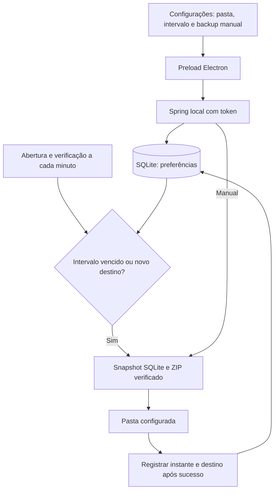

# Backup configurável — New 1.8.0

## Conversão de tempos — New 1.17.0

A conversão automática para blocos de 2 minutos cria primeiro um ZIP local anterior em `rounding-safety`, ao lado da pasta de dados, e só depois altera o histórico recuperável em transação. Falha na criação da cópia impede a conversão. Configurações → Arredondamento do foco mostra o caminho da cópia e a quantidade convertida.

Restaurar um backup antigo usa a cópia anterior da própria restauração e converte os tempos recuperáveis dentro da mesma transação. `rounding_version` evita reconversão de backups já atualizados; legados sem precisão permanecem com o valor salvo. Consulte [Interface e arredondamento](Interface-e-arredondamento.md).

## Restaurar pela interface — New 1.16.0

1. Encerre qualquer apontamento em andamento ou pausado e abra Configurações → Restaurar backup.
2. Escolha um ZIP gerado pelo Foco. A prévia valida manifesto, SQLite, vínculos, esquema e restrições em base temporária; escolha sozinha não altera dados.
3. Confira os registros. A restauração substitui todo o SQLite, incluindo tarefas, apontamentos, catálogos, histórico, preferências e regras de jornada.
4. Marque a confirmação e clique Restaurar este backup. O arquivo é revalidado pelo SHA-256. A cópia do banco atual é criada em `restore-safety`, ao lado da pasta de dados, antes da importação. As operações de dados aguardam a transação terminar.
5. Após sucesso, anote o caminho da cópia anterior e clique Concluir e atualizar Foco. Se precisar desfazer, escolha esse ZIP pelo mesmo procedimento.

Sessões abertas no backup retornam pausadas, sem somar tempo durante a ausência. Perfil Electron, visões, rascunhos e estado diário de lembretes não são restaurados. Backups de versões anteriores compatíveis recebem padrões para colunas opcionais e tabelas ausentes ficam vazias; backups de esquema desconhecido/futuro são rejeitados. ZIP limitado a 512 MiB e banco a 256 MiB. Não há extração de caminhos arbitrários do ZIP.

Se a cópia anterior falhar, nada é importado. Se a transação falhar, as alterações de dados são revertidas; o histórico de tentativa de backup pode ser atualizado. ZIPs anteriores não são excluídos. Testes de restauração são executados em dados isolados, incluindo rollback, cópia anterior, backup antigo e recuperação de sessão aberta.

Em Configurações, o painel Backup carrega a pasta e o intervalo persistidos, permite selecionar outra pasta pelo diálogo Electron e gerar uma cópia manual. Intervalos devem ser inteiros de 1 a 525600 minutos; padrão de 24 horas. A API também valida o intervalo antes de gravar preferências.

O agendador consulta as preferências ao abrir e a cada minuto. Se não houver sucesso registrado, o destino mudar ou o intervalo terminar, cria uma cópia. Backups manuais ignoram o intervalo e reiniciam a contagem após sucesso. Uma configuração antiga sem instante do último sucesso ganha uma primeira cópia ao abrir. Não é necessário alterar o esquema do banco.

O snapshot SQLite usa `VACUUM INTO`. O ZIP é conferido antes de renomear o arquivo temporário; cópias anteriores são preservadas. Pastas dentro dos dados do Foco são rejeitadas. Falhas manuais são exibidas no painel e não avançam a contagem. O agendador tenta novamente após falha no próximo ciclo. O aplicativo precisa estar aberto para executar o automático.

## Resultado das tentativas — New 1.12.0

Configurações → Versão e diagnóstico local distingue data/resultado da última tentativa (manual ou automática) e data/destino do último sucesso. Falhas não apagam o sucesso anterior. Verificações antes do intervalo não contam como tentativa de criação. Use Atualizar diagnóstico após um backup.
