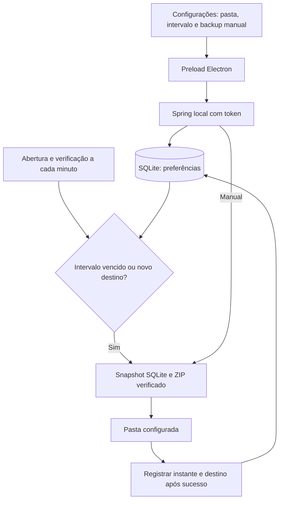

# Backup configurável — New 1.8.0

Em Configurações, o painel Backup carrega a pasta e o intervalo persistidos, permite selecionar outra pasta pelo diálogo Electron e gerar uma cópia manual. Intervalos devem ser inteiros de 1 a 525600 minutos; padrão de 24 horas. A API também valida o intervalo antes de gravar preferências.

O agendador consulta as preferências ao abrir e a cada minuto. Se não houver sucesso registrado, o destino mudar ou o intervalo terminar, cria uma cópia. Backups manuais ignoram o intervalo e reiniciam a contagem após sucesso. Uma configuração antiga sem instante do último sucesso ganha uma primeira cópia ao abrir. Não é necessário alterar o esquema do banco.

O snapshot SQLite usa `VACUUM INTO`. O ZIP é conferido antes de renomear o arquivo temporário; cópias anteriores são preservadas. Pastas dentro dos dados do Foco são rejeitadas. Falhas manuais são exibidas no painel e não avançam a contagem. O agendador tenta novamente após falha no próximo ciclo. O aplicativo precisa estar aberto para executar o automático.

## Resultado das tentativas — New 1.12.0

Configurações → Versão e diagnóstico local distingue data/resultado da última tentativa (manual ou automática) e data/destino do último sucesso. Falhas não apagam o sucesso anterior. Verificações antes do intervalo não contam como tentativa de criação. Use Atualizar diagnóstico após um backup.
