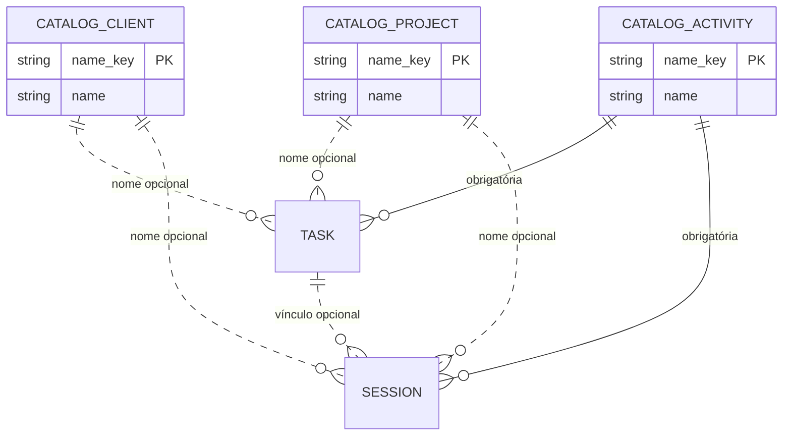

# Cadastros centrais

New 1.5.0 centraliza os nomes de clientes, projetos e atividades no espaço **Cadastros**. As três listas são independentes: não há vínculo obrigatório entre cliente e projeto. Cliente e projeto podem ficar vazios nos registros; quando preenchidos, precisam apontar para um item cadastrado. Toda tarefa e todo apontamento exigem atividade.

## Entidades e relações

As tabelas `catalog_clients`, `catalog_projects` e `catalog_activities` mantêm chaves normalizadas por caixa e espaços. Os campos textuais históricos de `sessions` e `tasks` continuam armazenando o nome canônico para manter compatibilidade com consultas, relatórios, importação e a instalação Stable. A integridade de seleção é validada pela API. Não há chave estrangeira entre os catálogos porque os registros legados da Stable ainda não os conhecem.

## Telas e fluxos

- **Cadastros** (atalho **Alt+N**) alterna entre Clientes, Projetos e Atividades, cadastra, renomeia, unifica ou exclui itens sem uso no histórico.
- **Apontar horas**, lançamento retroativo, edição de apontamento e **Tarefas** usam seletores com nomes cadastrados. Cliente e Projeto têm opção vazia; Atividade é obrigatória.
- **Configurações** escolhe clientes cadastrados ao manter suas cores. Ao unificar clientes, a cor do nome mantido prevalece; se não houver cor nele, a cor de origem é transferida.
- **Importação V35** preserva os textos de origem e inclui os nomes importados nos catálogos após a operação transacional.

## Migração e revisão de duplicidades

Na inicialização, nomes encontrados nas tarefas, apontamentos e cores de clientes são importados aos catálogos. Espaços repetidos são reduzidos e diferenças apenas de caixa/espaços convergem para o mesmo nome; os registros históricos recebem a forma canônica. A migração é aditiva e não remove os dados existentes.

O sistema mostra até 30 pares parecidos por catálogo, com similaridade de pelo menos 70%. A semelhança é uma sugestão para análise; nunca altera registros sozinha. A pessoa escolhe qual nome manter e confirma a unificação. A confirmação atualiza tarefas e apontamentos históricos para o nome escolhido. Renomear também atualiza o histórico. Excluir é recusado quando existem tarefas ou apontamentos usando o item.

## API

Todas as rotas usam o token local do backend:

| Método | Rota | Uso |
|---|---|---|
| GET | `/api/catalogs` | Listar catálogos e sugestões |
| POST | `/api/catalogs/{clients\|projects\|activities}` | Criar `{ "name": "..." }` |
| PUT | `/api/catalogs/{type}/{nome}` | Renomear usando `{ "name": "..." }` |
| POST | `/api/catalogs/{type}/merge` | Unificar usando `{ "source": "...", "target": "..." }` |
| DELETE | `/api/catalogs/{type}/{nome}` | Excluir item ainda sem uso histórico |

A API rejeita nomes vazios, nomes acima de 200 caracteres e duplicatas que só diferem em caixa ou espaços. Sessões, edição histórica, lançamento retroativo, tarefas, importação e cores validam os valores contra os catálogos.

## Casos de uso

1. **Cadastrar cliente, projeto ou atividade:** abrir Cadastros, escolher a lista, informar o nome e cadastrar. Depois, o item aparece nos seletores dos formulários.
2. **Corrigir nome duplicado:** conferir o par sugerido, escolher o nome canônico e confirmar. Tarefas e apontamentos anteriores passam a exibir o nome escolhido.
3. **Selecionar cliente/projeto opcional:** manter a opção vazia ou selecionar item cadastrado. Texto livre não é aceito pela API.
4. **Preservar legado:** ao iniciar a versão atualizada, os valores encontrados nos dados locais são adicionados automaticamente; nenhum par parecido é unido sem confirmação.

## Validação

`CatalogApiTest` cobre criação normalizada e duplicata, campos opcionais, atividade obrigatória, rejeição de valores inexistentes e atualização histórica apenas após unificação expressa. `CatalogsPage.test.tsx` cobre a escolha humana de duplicidade e o cadastro pelo espaço central.

## Projetos arquivados — 1.14.0

Projetos têm filtro Ativos/Arquivados/Todos e ações de arquivar/restaurar com confirmação. O nome de projeto é global no catálogo; o arquivamento afeta suas tarefas e atalhos em todos os clientes, mantendo apontamentos e relatórios. Renomeações preservam o arquivamento; unificação com projeto arquivado mantém esse estado e exige encerrar apontamentos ativos. [Fluxos completos](Quinta-onda.md).
