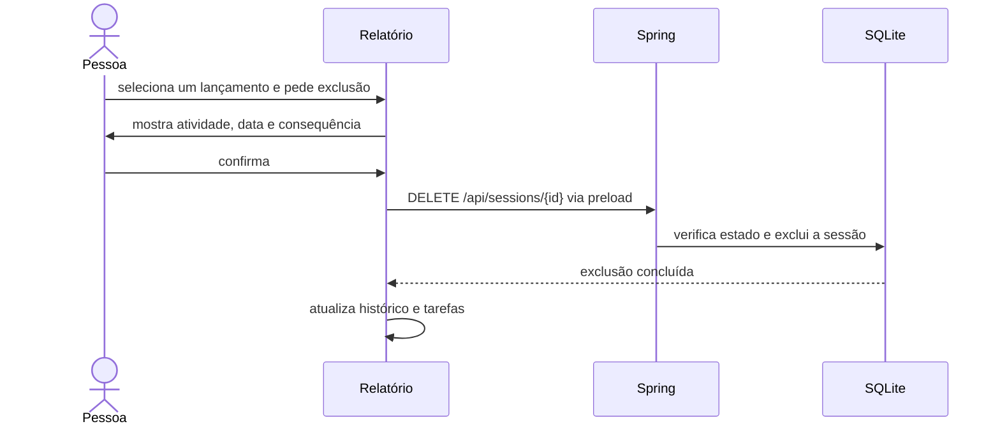
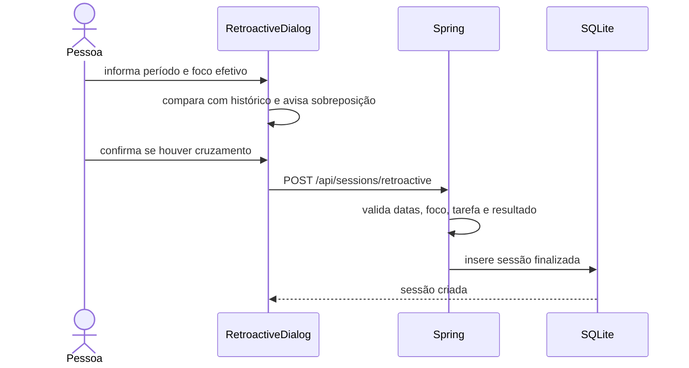
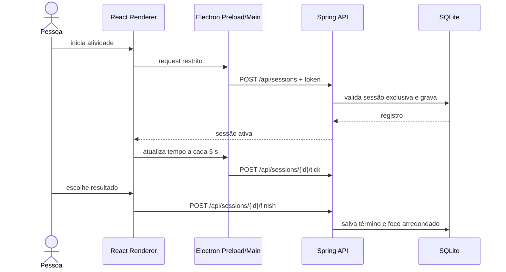

# Casos de uso

## New 1.17.0 — navegar e converter tempos anteriores

- **Navegar:** escolher uma tela na barra lateral ou por atalho; receber feedback visual e foco no título; continuar pelo teclado. Movimento reduzido do Windows desativa as animações.
- **Encerrar/trocar:** registrar o término real e arredondar somente o foco para cima em blocos de 2 minutos.
- **Atualizar o histórico:** na abertura, criar cópia anterior, recuperar o foco dos registros com ajuste conhecido e converter uma vez em transação. Se o backup ou a escrita falhar, manter os tempos anteriores. Consultar o resultado em Configurações.
- **Conferir legados:** visualizar o marcador de precisão indisponível na linha do relatório e manter o valor salvo. Restaurar backups antigos aplica a mesma regra de conversão na transação da restauração.

Diagrama e critérios em [Interface e arredondamento](Interface-e-arredondamento.md).

## Sétima onda — Jornada e recuperação

- **Consultar linha do tempo:** escolher um dia em Jornada, distinguir sessões, pausas precisas e períodos estimados; abrir edição de sessão finalizada ou classificar A definir. Alterações seguem os fluxos/validações existentes e atualizam a Jornada. Sessões abertas permanecem protegidas.
- **Definir jornada:** preencher os sete dias e vigência de hoje ou futura; API valida horários, ordem e sobreposição antes de escrever. Exceção por data substitui a semana, inclusive folga. Regras passadas são imutáveis. Falhas mantêm os campos preenchidos, sem mensagem de sucesso.
- **Restaurar cópia local:** selecionar ZIP, validar em banco isolado, conferir registros e confirmar substituição. API exige o hash conferido e ausência de sessão atual aberta; faz cópia de segurança e transação. Sucesso exibe o caminho anterior e permite recarregar. Arquivo alterado ou falha mantém os dados atuais e exige nova confirmação; nenhuma restauração ocorre apenas ao escolher um arquivo.

## CU01 — Apontar atividade

**Ator:** consultor. **Pré-condições:** aplicativo aberto; nenhuma sessão ativa.

1. Informa atividade; pode preencher cliente, projeto, detalhamento, consultor, card/link e valor/hora.
2. Escolhe Cronômetro ou duração programada e inicia.
3. O Foco grava no SQLite e atualiza a bandeja/sobreposição.
4. Pode pausar e retomar; encerramento exige escolher Concluída, Encerrada ou Interrompida.

**Alternativas:** a atividade vazia é rejeitada; se existir apontamento ativo, o diálogo de encerramento aparece antes de iniciar o próximo; ao reabrir uma instância que encerrou inesperadamente, o apontamento volta pausado.

O autocomplete usa o texto do campo atual e valores locais anteriores. Escolher uma opção altera somente esse campo. Apagar o detalhamento preserva o consultor solicitante e os demais dados.

## CU02 — Trabalhar com tarefa

No cadastro ou edição, as opções de cliente, projeto, atividade, consultor, card e valor/hora são filtradas pelo texto digitado em cada campo. A escolha preenche somente o campo atual; um valor desconhecido continua editável.

1. Cadastra cliente/projeto/atividade e demais campos, incluindo valor/hora opcional.
2. Consulta tarefas por estado ou texto, edita ou inicia novos apontamentos associados.
3. Cada sessão concluída aumenta o histórico e os totais da tarefa.
4. A conclusão é manual e bloqueada enquanto houver uma sessão aberta para a tarefa.

## CU03 — Consultar e corrigir histórico

1. Filtra por datas, cliente, projeto, atividade, consultor, resultado, duração e valor.
2. Seleciona linhas para editar, atualizar um campo em lote ou exportar a seleção.
3. Ao editar horários, o Foco mostra o tempo de foco derivado do intervalo entre início e término, preservando a exibição no fuso local.
4. O Foco valida início/término, mantém a sessão ligada à tarefa e salva os novos horários e foco no SQLite.
5. O CSV abre o diálogo nativo para escolha do arquivo e escapa células perigosas de planilha.
6. Para excluir, seleciona exatamente um lançamento finalizado, lê o resumo no diálogo e confirma. Spring recusa sessões em andamento ou pausadas e remove somente a sessão indicada; totais da tarefa e dashboard passam a refletir o restante.

## CU04 — Analisar horas e valores

1. Escolhe agrupamento (cliente, projeto, atividade ou consultor) e filtros.
2. Consulta indicadores, gráfico de distribuição, horas e valores.
3. Expande cliente/consultor para comparar subtotais por projeto.
4. Campos financeiros são omitidos quando a preferência de privacidade estiver desativada.

## CU05 — Migrar V35

1. Seleciona a pasta original pelo seletor do Windows.
2. O backend lê e valida XML sem DTD/XXE, valida limites e prepara os dados em transação.
3. Tarefas, sessões, preferências e cores são inseridas; sessões que estavam abertas viram interrompidas para decisão explícita no novo ambiente.
4. O hash fica marcado no banco novo; repetir a mesma importação não duplica dados.

**Falha:** XML malformado, inseguro ou fora dos limites cancela a transação e os XMLs originais permanecem intocados.

## CU06 — Criar backup

1. Informa destino nas configurações.
2. No primeiro uso diário ao abrir, e enquanto o app fica aberto, Spring cria um snapshot SQLite e um ZIP.
3. Confere a estrutura ZIP e mantém todas as cópias; a tela também oferece backup manual.

## CU07 — Registrar horas retroativas

1. Em Apontar horas, abre Lançamento retroativo e informa atividade, início e término passados.
2. Opcionalmente escolhe uma tarefa, inclusive concluída, e preenche os demais dados.
3. O formulário sugere a duração do intervalo; a pessoa ajusta horas/minutos para excluir pausas e escolhe o resultado final.
4. Se houver outro apontamento no intervalo, lê o aviso e confirma a sobreposição antes de continuar.
5. Spring valida período, foco efetivo e vínculo, grava a sessão finalizada e a interface atualiza histórico, dashboard e tarefas.

**Falhas:** intervalo invertido ou futuro, foco nulo ou maior que o intervalo, tarefa inexistente e resultado não final são rejeitados sem gravar sessão.

## Diagrama de sequência — iniciar e encerrar

## Categoria Agenda e prazo de tarefa

- No formulário de apontamento ou retroativo, a pessoa escolhe `Normal` ou `Agenda`; a API persiste e valida o valor. O relatório mostra o marcador, filtra por categoria e inclui a informação no CSV.
- Ao criar ou editar uma tarefa, a pessoa pode informar o prazo limite. A lista mostra o prazo e filtra tarefas por uma faixa de datas. Sem prazo, a tarefa continua válida e pode ser localizada pelos demais filtros.
- Os atalhos Alt trocam de tela e iniciam/pausam ou encerram o foco. A sobreposição apresenta atividade e relógio em uma faixa horizontal.

## Capturar, planejar e revisar atividades

Capturar uma frase → organizar como tarefa → escolher data e até o limite configurado de prioridades (padrão cinco) → iniciar apontamento → revisar tarefas e lacunas → salvar revisão do dia. Tarefas bloqueadas recebem estado Aguardando, dependência e data de revisão. Modelos reutilizam dados de uma tarefa; recorrências só são geradas pelo botão Criar tarefas previstas. Consulte [Planejamento](Planejamento.md).

New 1.10.0: registrar próxima ação ao encerrar/trocar uma tarefa; escolher prazo padrão; recuperar ou descartar rascunhos após navegação. Ver [fluxos e critérios](Primeira-onda.md).

## Segunda onda

1. Conferir horas: escolher base em Tarefas ou Relatórios; atualizar Relatórios e exportar CSV com bases de duração/término identificadas.
2. Corrigir associação: selecionar sessão finalizada, abrir Vincular tarefa, escolher destino ou remover vínculo e salvar; conferir totais e histórico.
3. Fechar lacunas: abrir Jornada → A definir → Revisar em sequência; navegar, escolher classificação e salvar cada intervalo. Reaproveitar classificação é opcional e não copia horários.
4. Retomar a visualização: reabrir telas com agrupamento, base, detalhes do Dashboard e ordenação anteriores, mantendo datas atuais.

Regras e critérios em [Segunda onda](Segunda-onda.md).

## Terceira onda

**Estimar e conferir capacidade:** em Hoje, selecionar tarefa, informar minutos e salvar; configurar capacidade diária; conferir soma e pendências sem estimativa para a data. Excesso informa sobrecarga e permite continuar. Vazio remove a estimativa; falha preserva o formulário.

**Revisar semana:** selecionar data em Hoje e abrir Revisão semanal; conferir grupos, abrir planejamento ou caixa de entrada e salvar cada decisão conscientemente. Abrir o painel não modifica dados.

**Consultar diagnóstico:** abrir Configurações e conferir canal/versão e resultado de backup; Atualizar diagnóstico relê os dados locais. Falha recente mantém o último sucesso visível. Detalhes em [Terceira onda](Terceira-onda.md).

## Comparar estimativas e conferir distribuição

No Dashboard, selecionar intervalo/base e Comparar horas para avaliar tarefas, projetos e semanas. Tarefas sem estimativa e apontamentos sem vínculo ficam identificados; a consulta não altera dados. Alterar filtros exige nova consulta. Mostrar todos os grupos abre a distribuição integral; o resumo inclui Outros e o PDF acompanha a escolha. [Fluxo AN-01/AN-04](Quarta-onda.md).

## Organização — New 1.14.0

- Gerenciar passos: abrir checklist, adicionar/editar/marcar/remover e consultar progresso; falha mantém texto, arquivamento permite somente consulta.
- Arquivar tarefa/projeto: confirmar, verificar ausência de apontamento ativo, remover prioridades e ocultar das listas de trabalho; alternativa de restauração mantém dados e não reativa antigas prioridades.
- Editar/pausar modelo: manter id e tarefas geradas, configurar frequência/data e pausar ou retomar; geração manual ignora pausados e origens arquivadas, com uma ocorrência vencida por ação.

Fluxos, alternativas e critérios completos em [Quinta onda](Quinta-onda.md).
## Sexta onda — New 1.15.0

- **Capturar com o Foco oculto:** ativar o atalho em Configurações ou escolher Capturar uma demanda na bandeja; a janela é restaurada e um diálogo recebe foco. Informar texto e salvar na caixa de entrada. Formulários anteriores permanecem abertos. Em falha de gravação, preservar o texto; se a captura foi salva mas a atualização da tela falhou, informar o resultado sem permitir repetir o mesmo texto.
- **Receber lembrete:** habilitar planejamento/revisão e horário. Com o aplicativo aberto, receber aviso nativo e no painel. Abrir a tela, adiar 15 minutos, dispensar ou silenciar hoje. Reinício não repete um aviso já entregue; virada do dia remove avisos antigos e reabilita os próximos. Sem suporte nativo, usar o painel.
- **Mover planejamento semanal:** em Tarefas e hoje → Planejamento semanal, escolher tarefa e data por arraste ou botão. Confirmar, com opção de preservar prioridade. Validar disponibilidade/limite e gravar mudança e histórico juntos. Se o destino estiver cheio, manter a data anterior e informar o motivo. Prazo e demais campos não são alterados.
- **Salvar e reutilizar uma visão:** configurar filtros/ordenação, escolher nome/período e salvar. Ao aplicar, recalcular Hoje/Semana atual ou manter datas fixas explicitamente escolhidas. Atualizar filtros, renomear e excluir exigem ações distintas. Falha de armazenamento mantém os controles e não apresenta sucesso.
- **Conferir arredondamento:** consultar Dashboard/Relatórios e comparar reais/arredondadas dos mesmos registros filtrados. Mostrar diferença acumulada, quantidade de históricos sem precisão e avisos de sessões provisórias. Incluir a comparação no PDF do Dashboard.

## Atualização 1.18.0

Na 1.18.0, o usuário abre Tarefas e hoje → Todas as tarefas → Planejar para ajustar data/prioridade/próxima ação. Em Configurações, salva o limite diário; valores inválidos não são gravados. Reduzir preserva prioridades existentes e impede novos acréscimos enquanto não houver vaga. [Detalhes](Tarefas-e-hoje.md).
