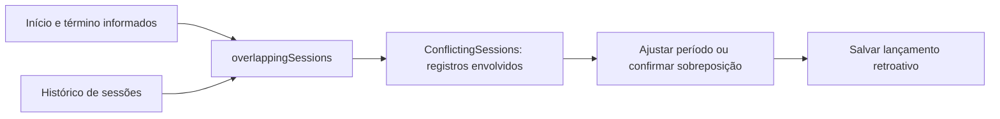

# Visualização de lançamentos conflitantes

Ao informar início e término no lançamento retroativo, os apontamentos que se sobrepõem ao período aparecem automaticamente antes da confirmação. Cada linha mostra atividade, detalhamento quando preenchido, cliente, projeto, início, término e estado. As datas e horas seguem o fuso local. Registros abertos mostram “Sem término registrado”.

A lista é ordenada pelo início e acompanha as alterações de horário. Se não houver conflito, ela desaparece. O usuário pode ajustar o intervalo ou marcar a confirmação existente para salvar mesmo com sobreposição.

`RetroactiveDialog` calcula os conflitos com `overlappingSessions` e entrega as sessões a `ConflictingSessions`, que apenas apresenta os registros. Não há nova entidade nem alteração da persistência. Intervalos que apenas se encostam não são conflitos.

O teste do diálogo verifica identificação, horários, exclusão de registros sem conflito e remoção da lista quando o usuário corrige o período. O teste de salvamento continua exigindo confirmação explícita.
