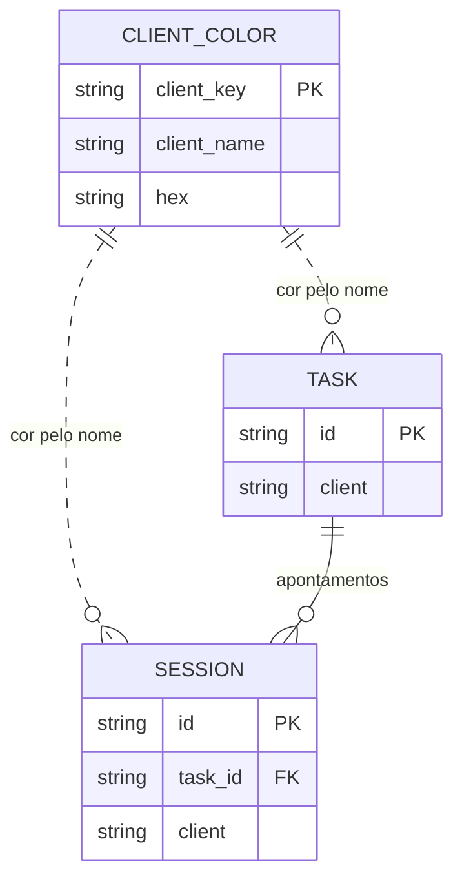
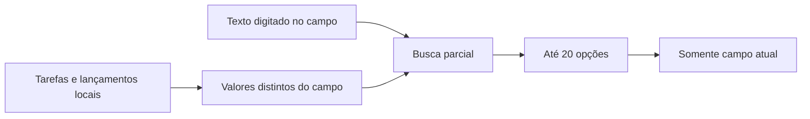

# Cores e autocomplete

## Entidades

`CLIENT_COLOR.client_key` identifica uma cor pelo nome normalizado do cliente. `TASK.client` e `SESSION.client` guardam o nome em cada registro; não há FK para a cor. A interface compara nomes sem espaços nas pontas e sem distinguir maiúsculas. Uma cor de cliente serve para identificar seus dados, enquanto `settings.accent` controla a cor geral da interface.

## Telas e comportamento

| Tela | Cor de cliente | Cor de destaque |
| --- | --- | --- |
| Apontar horas e lançamento retroativo | Marcador junto ao cliente e nos recentes | Botões, foco dos campos, seleção e progresso |
| Tarefas e relatórios | Marcador no cliente | Navegação, botões, seleção e foco |
| Dashboard | Marcador em grupos e projetos de um cliente | Primeiro segmento sem cor de cliente, seleção e botões |
| Configurações | Amostra da cor cadastrada | Controles e cor escolhida |

Grupos compartilhados por clientes diferentes não herdam cor de um cliente. Para um grupo com cor de cliente, essa cor continua identificando seus dados. O destaque segue a preferência do usuário no tema claro ou escuro; o texto de botões preenchidos muda entre claro e escuro conforme a luminosidade da cor escolhida.

## Autocomplete

Os campos Cliente, Projeto, Atividade, Consultor, Card/link e Valor por hora em **Apontar horas**, **Tarefas** e **Lançamento retroativo** consultam valores locais já usados em tarefas e lançamentos. Enquanto a pessoa digita, cada campo mostra até 20 valores distintos que contêm seu texto, sem diferenciar maiúsculas/minúsculas. Escolher uma opção altera somente aquele campo. Os outros campos não filtram as opções nem recebem conteúdo automaticamente. O detalhamento permanece texto livre. Valor por hora aparece conforme a preferência de exibição financeira e usa vírgula decimal brasileira nas opções.

## Validação esperada

1. Digitar parte de um projeto mostra projetos compatíveis mesmo se Cliente ou Atividade já tiverem outro valor; escolher o projeto não altera esses outros campos.
2. Texto sem correspondência permanece aceito e não sugere opções. O valor já digitado por completo não aparece como sugestão redundante.
3. Valor por hora sugerido preserva a vírgula decimal. Detalhamento pode ser apagado sem alterar Consultor.
4. Uma cor de cliente aparece nos seus registros; uma cor de destaque clara ou escura mantém o texto legível nos botões.
