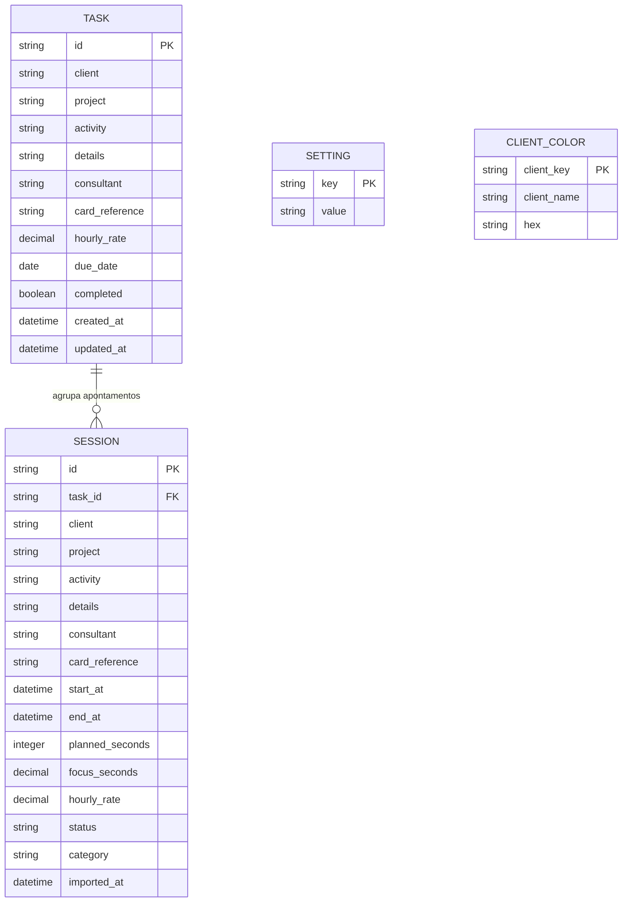
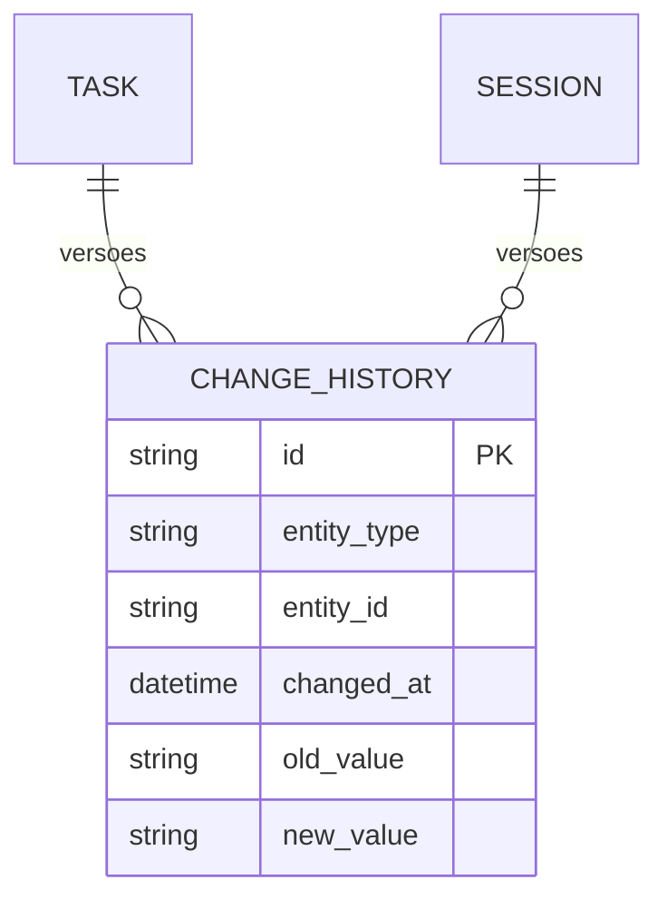
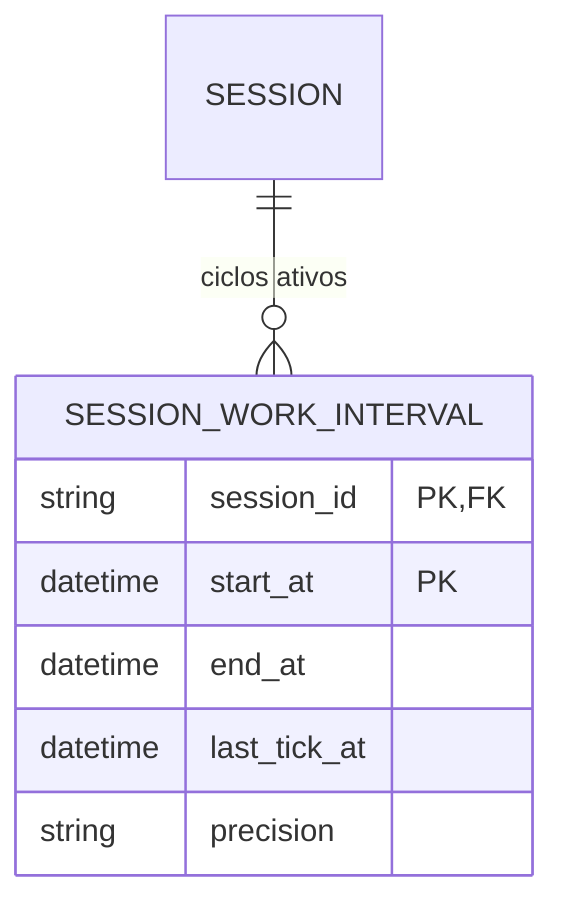
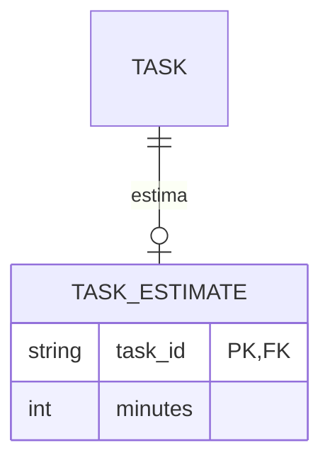
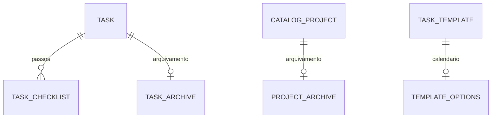

# Entidades e relações

A Stable 1.14.0 usa as mesmas entidades e migrações aditivas descritas para as entregas New até 1.14.0. A promoção de canal e o ajuste do instalador não acrescentam campos, tabelas ou migrações.

Na New 1.9.1, o Dashboard deriva horas reais de `focus_seconds`, `end_at` e `rounded_end_at`, removendo somente o acréscimo registrado. Não há novos campos persistidos. Totais e valores financeiros seguem `hoursMode`; detalhes em [Horas do Dashboard](Horas-do-dashboard.md).

## Cadastros centrais (New 1.5.0)

Clientes, projetos e atividades vivem em tabelas independentes: `catalog_clients`, `catalog_projects` e `catalog_activities`. `name_key` guarda a forma insensível a caixa e espaços e `name` é a forma canônica apresentada. Sessões e tarefas continuam registrando o nome textual para compatibilidade; a API garante que os valores preenchidos existam no catálogo. Cliente/projeto podem ser vazios; atividade é obrigatória. A seleção não cria relação entre as listas.

Renomear ou unificar propaga a forma canônica a `sessions` e `tasks`. Na unificação a pessoa escolhe qual nome continua e confirma a atualização histórica. Sugestões de semelhança são somente informativas. A inicialização importa valores existentes e remove diferenças simples de caixa/espaçamento sem unir grafias distintas.

O banco SQLite está no diretório local do usuário. As datas são texto ISO 8601 com deslocamento; valores monetários são decimais serializados sem formatação localizada, evitando arredondamento por configuração regional.

## Diagrama de entidades

## Regras das relações

- Uma tarefa agrega zero ou mais sessões. Ao remover a tarefa sem registros, o vínculo é apagado; sessões históricas são preservadas e não permitem apagar tarefa com apontamentos.
- Sessão criada a partir de tarefa recebe cópia dos dados necessários. O histórico continua compreensível se a tarefa for editada depois.
- No máximo uma sessão pode estar `Em andamento` ou `Pausada`. A sessão pode terminar `Concluída`, `Encerrada` ou `Interrompida`.
- Uma sessão retroativa já nasce em um desses três estados finais, com `planned_seconds=0`, início e término passados e `focus_seconds` entre um minuto e a duração do intervalo. Pode pertencer a uma tarefa já concluída. Nenhuma coluna nova é necessária.
- `planned_seconds=0` representa cronômetro sem limite; tempo pausado não soma em `focus_seconds`.
- `category` identifica `Normal` ou `Agenda`; registros antigos e lançamentos sem escolha recebem `Normal`.
- `due_date` é o prazo limite opcional de uma tarefa, armazenado como data ISO (`AAAA-MM-DD`), sem horário.
- `hourly_rate` nulo oculta valor e custo da sessão. A preferência `showValues=false` também esconde campos financeiros da interface e do CSV.
- Configurações são pares chave/valor; cores são identificadas por nome normalizado do cliente, mantendo a grafia exibida.
- A cor é resolvida na interface pelo nome do cliente em tarefas e lançamentos; não há coluna de cor duplicada nessas tabelas. O dashboard só associa cor a um grupo de projeto quando o filtro atual contém um único cliente nesse grupo.
- A tabela settings também guarda hashes de importação e preferências de backup: `backup.destination`, `backup.intervalMinutes` (padrão 1440), `backup.lastSuccessAt` (instante UTC), `backup.lastDestination` e `backup.lastSuccessDay` (compatibilidade). O último sucesso manual ou automático inicia a contagem; falhas não avançam o agendamento. Uma mesma origem V35 só pode ser importada uma vez neste banco.

## Cálculos

`custo = valor_hora × segundos_de_foco / 3600`, arredondado para centavos apenas na apresentação/exportação. Ao encerrar, o tempo é arredondado para cima em blocos de cinco minutos, preservando a regra V35; durante uma pausa, o valor é o tempo acumulado sem arredondamento final.

Para lançamentos retroativos, a pessoa informa horas e minutos efetivos. O backend grava `focus_seconds = (horas × 60 + minutos) × 60`, sem aplicar o arredondamento do cronômetro ao encerrar.
Edições descritivas mantêm `focus_seconds` e os instantes originais; a alteração de início ou término recalcula o foco pelo novo intervalo.

## Estado manual e historico (New 1.7.0)

`tasks.state` e opcional para manter compatibilidade: sem valor, a API calcula `Concluida` por `completed`, `Em andamento` quando ha apontamentos e `Pendente` nos demais casos. A API salva um dos tres estados validos quando alterado manualmente e mantem `completed` sincronizado com `Concluida`.

`change_history` guarda snapshots JSON de criacao, edicao, mudanca de estado e exclusao de tarefas e sessoes. O cronometro nao gera uma linha por tick; pausa, retomada e encerramento sao eventos versionados.

## Jornada e Extra-time

A apuração considera dias úteis, janela 09:00–12:00 e 13:00–18:00 no fuso local, meta de oito horas efetivas e almoço excluído. Lacunas entre apontamentos dentro das janelas viram períodos **A definir** e contam como trabalho. O tempo acima de oito horas efetivas aparece como Extra-time. A tabela `session_work_intervals` guarda blocos ativos precisos de sessões novas; para sessões antigas, usa início e término como estimativa e marca `precision=Estimado`.

## Término real e arredondado

Ao finalizar ou trocar uma atividade, `end_at` guarda o instante real e `rounded_end_at` guarda esse instante mais o ajuste do foco para o próximo bloco de cinco minutos. Exemplo: 7 minutos de foco viram 10; o término arredondado fica 3 minutos depois do real. Pausas não são adicionadas ao ajuste. Jornada, conflitos e início da próxima tarefa continuam usando o término real. Foco e custo mantêm a regra atual.

Relatórios oferece **Término exibido: Real / Arredondado**, com Real como padrão. A escolha também acompanha a coluna Término do CSV. Registros antigos e XML importados usam o término disponível quando não há segundo valor; não se inventa um ajuste histórico. Retroativos salvam ambos iguais, pois não arredondam o foco. Alterar horários históricos redefine ambos para o término informado; editar descrições preserva os dois.

## Organização pessoal — New 1.9.0

`task_inbox` guarda capturas independentes; `task_plans` associa planejamento, ordem das prioridades, próxima ação e dependência à tarefa; `task_templates` referencia uma tarefa para cópias e recorrência manual; `daily_reviews` guarda notas por dia. `tasks.state` também aceita **Aguardando**. Data planejada não substitui `due_date`. Campos, relações e regras em [Planejamento](Planejamento.md).

New 1.10.0: `task_plans.next_action` também é atualizado nos encerramentos e trocas, sem alterar os outros campos. `settings.tasks.defaultDueDate` aceita `empty`/`today`. Rascunhos `foco.draft.v1.*` vivem no localStorage, separados do SQLite e de seus backups. Ver [Primeira onda](Primeira-onda.md).

## Segunda onda — compatibilidade

Nenhuma tabela nova. `sessions.task_id` passa a ter correção explícita com histórico transacional em `change_history`; sessões ativas não podem mudar de tarefa por essa ação. A projeção `TaskRow` acrescenta `realFocusSeconds` calculado, mantendo `focusSeconds` original. Preferências `foco.view.v1.*` ficam no perfil local Electron, fora do SQLite/backup. A fila de lacunas é transitória; rascunhos continuam separados por intervalo. Consulte [Segunda onda](Segunda-onda.md).

## Terceira onda — estimativas

`task_estimates(task_id PK/FK, minutes)` mantém uma estimativa opcional por tarefa; ausência de linha significa sem estimativa. Exclusão da tarefa remove a estimativa em cascata. Valores de 1 a 100000 minutos; alteração e remoção registram histórico transacional. `settings.planning.capacityMinutes` configura capacidade de 0 a 1440 minutos, padrão 480. `backup.lastAttemptAt`, `backup.lastResult` e `backup.lastMessage` distinguem tentativa e sucesso. A revisão semanal é calculada, sem nova entidade. Ver [Terceira onda](Terceira-onda.md).

## Projeções de análise — 1.13.0

Sem novas entidades persistidas: `PlanningAnalysis` projeta `tasks`, `task_plans`, `task_estimates`, `sessions` e capacidade em `settings`. `AnalysisTask`, `AnalysisGroup` e `AnalysisWeek` expressam estimativas ausentes, carga planejada, realizado, capacidade semanal parcial e trabalho sem vínculo. Estimativas e capacidade atuais não são snapshots históricos. [Contrato e regras](Quarta-onda.md).

## Checklist, arquivamento e opções de modelo — 1.14.0

`task_checklist(id, task_id, title, completed, position)` guarda passos sem tempo próprio. `task_archive(task_id, archived_at)` marca arquivamento individual, independente de estado/conclusão. `project_archive(name_key, archived_at)` marca projetos globais do catálogo; a chave estrangeira acompanha renomeação. `template_options(template_id, paused, weekdays, month_day)` complementa modelos; ausência de linha mantém o comportamento legado. Exclusões de tarefas sem apontamentos removem passos/arquivo; exclusões de modelo removem suas opções. Arquivamento nunca exclui entidades nem sessões. Contratos e regras em [Quinta onda](Quinta-onda.md).

