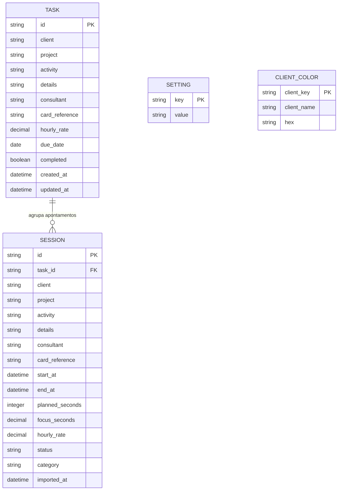

# Entidades e relações

O banco SQLite está no diretório local do usuário. As datas são texto ISO 8601 com deslocamento; valores monetários são decimais serializados sem formatação localizada, evitando arredondamento por configuração regional.

## Diagrama de entidades

## Regras das relações

- Uma tarefa agrega zero ou mais sessões. Ao remover a tarefa sem registros, o vínculo é apagado; sessões históricas são preservadas e não permitem apagar tarefa com apontamentos.
- Sessão criada a partir de tarefa recebe cópia dos dados necessários. O histórico continua compreensível se a tarefa for editada depois.
- No máximo uma sessão pode estar `Em andamento` ou `Pausada`. A sessão pode terminar `Concluída`, `Encerrada` ou `Interrompida`.
- Uma sessão retroativa já nasce em um desses três estados finais, com `planned_seconds=0`, início e término passados e `focus_seconds` entre um minuto e a duração do intervalo. Pode pertencer a uma tarefa já concluída. Nenhuma coluna nova é necessária.
- `planned_seconds=0` representa cronômetro sem limite; tempo pausado não soma em `focus_seconds`.
- `category` identifica `Normal` ou `Agenda`; registros antigos e lançamentos sem escolha recebem `Normal`.
- `due_date` é o prazo limite opcional de uma tarefa, armazenado como data ISO (`AAAA-MM-DD`), sem horário.
- `hourly_rate` nulo oculta valor e custo da sessão. A preferência `showValues=false` também esconde campos financeiros da interface e do CSV.
- Configurações são pares chave/valor; cores são identificadas por nome normalizado do cliente, mantendo a grafia exibida.
- A cor é resolvida na interface pelo nome do cliente em tarefas e lançamentos; não há coluna de cor duplicada nessas tabelas. O dashboard só associa cor a um grupo de projeto quando o filtro atual contém um único cliente nesse grupo.
- A tabela settings também guarda hashes de importação e destino/data do backup. Uma mesma origem V35 só pode ser importada uma vez neste banco.

## Cálculos

`custo = valor_hora × segundos_de_foco / 3600`, arredondado para centavos apenas na apresentação/exportação. Ao encerrar, o tempo é arredondado para cima em blocos de cinco minutos, preservando a regra V35; durante uma pausa, o valor é o tempo acumulado sem arredondamento final.

Para lançamentos retroativos, a pessoa informa horas e minutos efetivos. O backend grava `focus_seconds = (horas × 60 + minutos) × 60`, sem aplicar o arredondamento do cronômetro ao encerrar.
Edições descritivas mantêm `focus_seconds` e os instantes originais; a alteração de início ou término recalcula o foco pelo novo intervalo.
