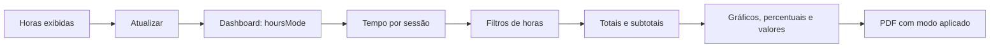

# Dashboard: horas reais e arredondadas — New 1.9.1

## Comparação simultânea — New 1.15.0

`GET /api/dashboard` passa a retornar `comparison`: `realSeconds`, `roundedSeconds`, `differenceSeconds`, `unknownPrecision` e `ongoingSessions`. As duas somas usam exatamente os registros selecionados pela consulta atual, inclusive limites de horas da base escolhida; mudar essa base pode mudar quais registros passam pelo filtro. `differenceSeconds` é a diferença não negativa entre as somas, sem contabilizar pausas. Sessões finalizadas sem um dos términos são contadas em `unknownPrecision` e conservam o tempo salvo; abertas/pausadas ficam em `ongoingSessions`, com valores provisórios. Relatórios calcula o mesmo resumo dos registros exibidos, incluindo o filtro de conflitos. Lacunas mantêm a duração nas duas bases e não entram na contagem histórica. O PDF do Dashboard inclui esse resumo. Nenhuma sessão é regravada.

Em **Dashboard → Horas exibidas**, selecione **Arredondadas** (padrão anterior) ou **Reais** e clique em **Atualizar**. A seleção afeta o total, gráficos, percentuais, subtotais por projeto, valores financeiros e filtros de horas mínimas/máximas por sessão. A ordenação utiliza os valores resultantes.

O indicador de horas e o cabeçalho do PDF identificam o modo aplicado. Alterar a seleção sem atualizar bloqueia a exportação; se a consulta falhar, o painel mantém o modo anteriormente aplicado e o PDF continua bloqueado.

## Regra de cálculo

- **Arredondadas:** soma `focus_seconds`. Desde a New 1.17.0, sessões encerradas pelo cronômetro usam o próximo bloco de dois minutos. O histórico com ajuste recuperável também é convertido; legados sem precisão e registros sem acréscimo comprovado são preservados. Sessões abertas e retroativos mantêm o tempo salvo, sem arredondamento adicional no gráfico.
- **Reais:** subtrai de `focus_seconds` somente a diferença positiva entre `rounded_end_at` e `end_at`. Sete minutos de foco salvos como oito aparecem como sete no modo real e oito no arredondado. Históricos preservados usam o ajuste disponível, inclusive de versões anteriores. Não se usa a diferença total entre início e fim, que incluiria pausas.
- **Legados:** sem os dois términos, conserva-se o tempo salvo; não se inventa um incremento histórico. Retroativos com términos iguais e sessões abertas não sofrem desconto.
- **Valores:** cada sessão usa `valor/hora × horas no modo escolhido`. Nenhum valor persistido é alterado. Sessões sem tarifa continuam contabilizadas como sem valor/hora.
- **A definir:** mantém a duração real da lacuna nos dois modos, sem arredondar novamente ou atribuir valor financeiro. Seus filtros consideram essa duração.

## Contrato técnico

`GET /api/dashboard` recebe `hoursMode=rounded|real`, com `rounded` como padrão compatível. Valores diferentes são rejeitados. Uma subconsulta calcula `selected_seconds` por sessão, compartilhado pelos filtros e agregações de totais, grupos e projetos. A diferença de términos usa `julianday`, arredondada a milissegundos para compensar a imprecisão de ponto flutuante do SQLite; o foco resultante nunca é negativo.

Não há migração nem regravação das sessões. O renderer continua chamando apenas o preload Electron, com autenticação local e backend em loopback.

Testes Java verificam grupos, projetos, custos, pausas, legados, retroativos, sessões pausadas, precisão fracionária, fusos, filtros, resultados vazios e modo inválido. Vitest verifica seleção, aplicação, identificação no PDF e comportamento em falhas.

## Extensão na New 1.11.0

A mesma regra de horas reais/arredondadas chega aos totais de Tarefas, aos filtros e valores de Relatórios e ao CSV. `HoursBasis` centraliza a expressão Java antes descrita diretamente no Dashboard. Preferências por tela são locais; modo de duração e modo de término continuam independentes. Consulte [Segunda onda](Segunda-onda.md).
