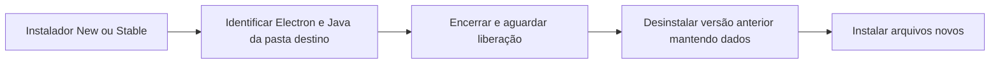

# Instalação local do Foco New e Stable

## New e Stable 1.18.0 — instaladas — 07/10/2026

New e Stable 1.18.0 instaladas nas pastas existentes, com saída 0 e executáveis 1.18.0.0. ASAR/JAR de cada instalação iguais ao pacote por SHA-256. Ambas abertas e verificadas em sequência, com janela respondendo e backend HTTP 200/401. Stable deixada aberta ao final. Antes das instalações, backup SQLite verificado; as 20 tabelas e todos os 274 apontamentos preservados. Apenas o campo opcional `catalog_projects.color_seed` foi adicionado; projetos antigos continuam nulos. Preferências funcionais e histórico mantidos.

Evidências locais: `.atualizacao_status/eighth-install.json`, `eighth-install-data.json`, `eighth-install.log` e logs de abertura dos dois canais. Backup anterior em `antes-dual-1.18.0-*.db`; nove backups anteriores conservados. O roteiro foi corrigido para tratar o log ainda vazio durante a inicialização; a reinstalação final e todas as conferências terminaram com sucesso.

## New 1.17.0 — instalada — 06/10/2026

Instalada sobre a New 1.16.0 por solicitação do usuário. Antes da operação, o usuário pausou o cronômetro; backup SQLite íntegro e verificado criado com 20 tabelas e 266 sessões. Instalador terminou com saída 0; executável 1.17.0.0 e hashes ASAR/JAR iguais ao pacote. Foco reaberto com janela respondendo, saúde HTTP 200 e tarefas sem token rejeitadas com 401.

A primeira abertura converteu 41 históricos recuperáveis para blocos de 2 minutos, preservando o foco real e os demais campos. Todos os 266 IDs foram conservados, incluindo 216 legados finalizados sem precisão. Retroativos e sessões sem ajuste conhecido mantiveram o tempo salvo. A sessão do usuário permanece pausada com 1.342 segundos (22min22s), pronta para retomada. Histórico anterior e preferências funcionais preservados; adicionados os 41 registros de auditoria da conversão. As demais tabelas mantiveram o conteúdo; integridade `ok`.

Além da cópia SQLite anterior à instalação em `.atualizacao_status/antes-new-1.17.0-*.db`, a migração criou seu ZIP em `rounding-safety`, ao lado dos dados, conferido por integridade e valores anteriores. Evidências em `.atualizacao_status/experience-install*`, `experience-app-*.log` e `experience-install-data.json`. Instalador/blockmap New 1.16.0 substituídos removidos, preservando New 1.17.0, Stable e nove backups locais. Regras e limites em [Interface e arredondamento](Interface-e-arredondamento.md).

## New 1.16.0 — 06/10/2026

Instalada sobre a New 1.15.0 e reaberta por solicitação do usuário. Sem apontamentos ativos/pausados antes da operação; backup SQLite verificado com 18 tabelas e 262 sessões. Instalador terminou com saída 0, versão 1.16.0.0 e hashes de ASAR/JAR iguais ao pacote. Após instalar e abrir, todas as 18 tabelas anteriores mantiveram seu conteúdo; as duas novas tabelas de jornada foram criadas vazias. Integridade `ok`.

Janela Foco aberta/respondendo, com renderer e backend da instalação em execução. Saúde HTTP 200 e tarefas sem token HTTP 401. Logs desta inicialização sem `Uncaught`, `Exception`, `Caused by:` ou `ERROR`. Registros e backup em `.atualizacao_status/seventh-wave-install*` e `antes-new-1.16.0-*.db`. Banco de uso não foi restaurado nem teve sua jornada alterada.

## New 1.15.0 — 06/10/2026

Instalada e aberta por solicitação do usuário. A instalação encontrada já indicava 1.15.0 e estava fechada; o pacote conferido foi reinstalado com saída 0. Backup SQLite íntegro criado antes da operação, sem sessões ativas/pausadas. Versão instalada 1.15.0.0 e hashes ASAR/JAR iguais ao pacote. Todas as 18 tabelas mantiveram seu conteúdo, incluindo 261 sessões, após instalação e abertura; integridade `ok`.

Janela Foco aberta e respondendo, com renderer e backend da pasta instalada em execução. Saúde HTTP 200 e tarefas sem token HTTP 401. Logs de inicialização não apresentaram `Uncaught`, `Exception` ou `ERROR`; isso não identifica a causa da janela anteriormente fechada. Registros e backup em `.atualizacao_status/sixth-wave-install*` e `antes-new-1.15.0-*.db`.

## Stable 1.14.0 — 06/10/2026

A promoção incorpora à Stable o mesmo gancho de liberação dos arquivos usado na New. `close-installed.ps1` reconhece `Foco New.exe` e `Foco Stable.exe` somente dentro da pasta de destino e o backend Java dessa pasta. As duas configurações NSIS incluem o gancho; a Stable mantém instalação assistida e escolha de diretório. A suíte cobre os dois canais e a exclusão dos processos de outras pastas. Nenhuma mudança de esquema é necessária para essa correção.

## Correção do erro 2 — New 1.13.1

O instalador NSIS retorna 2 quando o desinstalador da versão anterior retorna um erro. O Foco funciona também na bandeja e mantém um backend Java fora da pasta do executável Java. Encerrar somente o Electron pode deixar o JAR em uso, inclusive quando o Java do PATH é um lançador que abre outro processo Java.

O instalador New inclui `desktop/build/installer.nsh`. Antes de remover a versão anterior, o gancho `customCheckAppRunning` executa `close-installed.ps1` com a pasta de destino. O script identifica o executável New pelo caminho completo e processos Java pelo argumento `-jar` do backend dessa mesma pasta; aguarda até cinco segundos pela liberação. Não encerra Java de outros programas nem executáveis de outras instalações. Se não conseguir liberar os arquivos, interrompe a instalação com uma mensagem, sem ignorar o erro do desinstalador.

O gancho fica também no novo desinstalador, para as próximas atualizações. A correção pertence ao código de empacotamento e foi incorporada aos builds New a partir de 1.13.1 e Stable a partir de 1.14.0. Não há alteração de entidades ou esquema de dados.

## Validação em 02/10/2026

- `npm test`: 73 testes Java e 131 Vitest aprovados. O teste do script cobre Electron, os dois formatos de argumento Java, caminhos de outros programas, Stable e um JAR com nome semelhante.
- `npm run build`: pacote New 1.13.1 gerado com sucesso.
- Instalação sobre a versão anterior aberta e reinstalação sobre a própria 1.13.1 aberta: ambas com saída 0. Não houve encerramento manual prévio.
- ASAR e JAR instalados idênticos aos do pacote por SHA-256; versão do executável 1.13.1.0.
- Backups SQLite antes das duas instalações em `.atualizacao_status/antes-new-1.13.1-*.db`; todas as tabelas comparadas por conteúdo antes/depois da instalação e inicialização. Integridade `ok`.
- Backend instalado: saúde HTTP 200; consulta de tarefas sem token rejeitada com HTTP 401. Processos do New respondendo após abertura.

Registros locais: `.atualizacao_status/installer-tests.log`, `installer-build.log`, `installer-install.log` e `installer-reinstall.log`. Foco WPF e instaladores anteriores preservados; nenhuma publicação externa.
