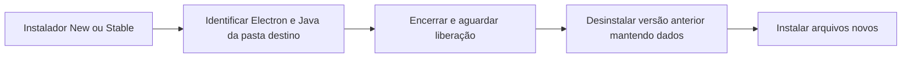

# Instalação local do Foco New e Stable

## Stable 1.14.0 — 06/10/2026

A promoção incorpora à Stable o mesmo gancho de liberação dos arquivos usado na New. `close-installed.ps1` reconhece `Foco New.exe` e `Foco Stable.exe` somente dentro da pasta de destino e o backend Java dessa pasta. As duas configurações NSIS incluem o gancho; a Stable mantém instalação assistida e escolha de diretório. A suíte cobre os dois canais e a exclusão dos processos de outras pastas. Nenhuma mudança de esquema é necessária para essa correção.

## Correção do erro 2 — New 1.13.1

O instalador NSIS retorna 2 quando o desinstalador da versão anterior retorna um erro. O Foco funciona também na bandeja e mantém um backend Java fora da pasta do executável Java. Encerrar somente o Electron pode deixar o JAR em uso, inclusive quando o Java do PATH é um lançador que abre outro processo Java.

O instalador New inclui `desktop/build/installer.nsh`. Antes de remover a versão anterior, o gancho `customCheckAppRunning` executa `close-installed.ps1` com a pasta de destino. O script identifica o executável New pelo caminho completo e processos Java pelo argumento `-jar` do backend dessa mesma pasta; aguarda até cinco segundos pela liberação. Não encerra Java de outros programas nem executáveis de outras instalações. Se não conseguir liberar os arquivos, interrompe a instalação com uma mensagem, sem ignorar o erro do desinstalador.

O gancho fica também no novo desinstalador, para as próximas atualizações. A correção pertence ao código de empacotamento e foi incorporada aos builds New a partir de 1.13.1 e Stable a partir de 1.14.0. Não há alteração de entidades ou esquema de dados.

## Validação em 02/10/2026

- `npm test`: 73 testes Java e 131 Vitest aprovados. O teste do script cobre Electron, os dois formatos de argumento Java, caminhos de outros programas, Stable e um JAR com nome semelhante.
- `npm run build`: pacote New 1.13.1 gerado com sucesso.
- Instalação sobre a versão anterior aberta e reinstalação sobre a própria 1.13.1 aberta: ambas com saída 0. Não houve encerramento manual prévio.
- ASAR e JAR instalados idênticos aos do pacote por SHA-256; versão do executável 1.13.1.0.
- Backups SQLite antes das duas instalações em `.atualizacao_status/antes-new-1.13.1-*.db`; todas as tabelas comparadas por conteúdo antes/depois da instalação e inicialização. Integridade `ok`.
- Backend instalado: saúde HTTP 200; consulta de tarefas sem token rejeitada com HTTP 401. Processos do New respondendo após abertura.

Registros locais: `.atualizacao_status/installer-tests.log`, `installer-build.log`, `installer-install.log` e `installer-reinstall.log`. Foco WPF e instaladores anteriores preservados; nenhuma publicação externa.
