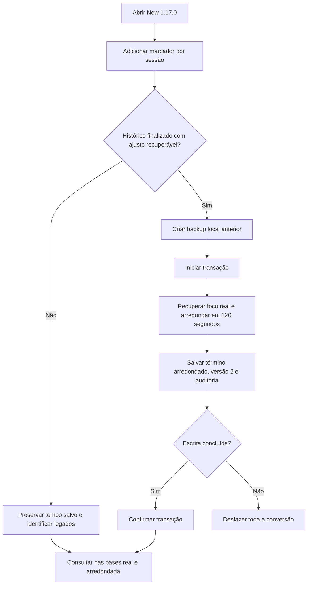

# Interface e arredondamento — New 1.17.0

Solicitados em 06/10/2026: uma UI mais expressiva, com cores, profundidade e movimento, e arredondamento para cima em blocos de 2 minutos, também no histórico recuperável. Por decisão do usuário, os legados sem precisão são preservados e identificados.

## Interface

O visual compartilhado usa superfícies com cantos suaves, sombras, gradientes ligados à cor de destaque, abas com seleção visível e botões com relevo, feedback ao passar o cursor e ao pressionar. A barra lateral acompanha a rolagem; em janelas compactas, conserva ícones com nomes acessíveis. As fontes são do sistema, sem downloads.

Ao navegar, a tela entra com transição curta e o título recebe foco para continuar pelo teclado. A animação ocorre na troca de página; atualizações do cronômetro, tema ou formulário não recriam a tela. Os cards e diálogos têm entrada progressiva. O cronômetro ativo tem um indicador animado, sem animar os números ou emitir anúncios a cada segundo.

O Windows pode solicitar movimento reduzido: nesse modo, animações, transições e deslocamentos dos botões são desativados. A impressão também desativa movimento e conserva o layout do PDF. Temas claro, escuro e escuro do sistema usam a mesma hierarquia e controles.

## Regra de tempo

Ao encerrar ou trocar de tarefa, `foco_arredondado = ceil(foco_real / 120) × 120`. Zero permanece zero; 2min exatos permanecem 2min; 2min01s viram 4min; 7min viram 8min. Pausar não arredonda. `end_at` continua real; `rounded_end_at` recebe apenas o novo acréscimo. Pausas, conflitos e jornada continuam usando os intervalos reais. Custos, totais por tarefa, Dashboard e CSV seguem a base real/arredondada escolhida.

Retroativos e edições explícitas de horários mantêm o tempo informado. Registros com términos iguais não comprovam um arredondamento anterior e são conservados: podem ser retroativos, ajustes manuais ou blocos antigos exatos. Não se usa o intervalo total entre início/fim para adivinhar o foco, pois incluiria pausas.

## Conversão do histórico

Na primeira abertura da nova versão, adicionar `sessions.rounding_version INTEGER NOT NULL DEFAULT 0`. Selecionar somente sessões finalizadas, versão 0, com ambos os términos e acréscimo positivo recuperável. Recuperar o foco real subtraindo o acréscimo antigo; aplicar os 120 segundos e reconstruir somente o término arredondado. Marcar versão 2, sem repetir a operação em futuras aberturas. Novos encerramentos também usam versão 2.

Antes de converter qualquer tempo, gerar um ZIP íntegro com os dados anteriores em `rounding-safety`, ao lado do diretório de dados. A conversão e o histórico de alterações são transacionais; falha de backup impede a operação e falha na escrita desfaz os tempos, marcadores e registros de auditoria. Ajustes inconsistentes são rejeitados, sem inventar foco real. `rounding.migratedSessions` e `rounding.safetyBackup` mostram a última conversão em Configurações → Arredondamento do foco.

Legados sem segundo término conservam seu valor e aparecem como **Legado · precisão indisponível** na linha do relatório e na contagem da comparação de horas. A API conserva a ausência de `roundedEndAt`; o CSV com término arredondado usa o término real disponível. Sessões ativas/pausadas não são convertidas.

Restaurar um backup compatível antigo aplica a mesma conversão dentro da transação de restauração, após criar sua cópia de segurança anterior. Backups já convertidos mantêm a versão 2 e não são arredondados novamente. A importação V35 sem precisão permanece legada.

## Implementação e validação

`experience.css` fornece o visual e o movimento compartilhados; `App` reinicia a entrada apenas por rota e gerencia o foco; `TimerPanel` comunica a regra. `FocusRounding` centraliza o cálculo e a conversão por conexão. `RoundingMigration` coordena manutenção exclusiva, backup e transação na abertura; `LocalRestore` reaplica a conversão dentro da restauração. O renderer continua acessando Spring somente pelo preload, e Spring continua limitado a loopback/token local.

Cobertura Java: limites de 120 segundos, frações, zero, tempos inválidos, término real, custos, pausas, troca de tarefas, migração idempotente, backup anterior, rollback, falha de backup, histórico inconsistente, restauração antiga e compatibilidade do esquema. Vitest cobre foco na navegação, preservação do formulário ao mudar tema, identificação individual dos legados e informação da cópia anterior. Evidências locais: `.atualizacao_status/experience-tests.log`, `experience-build.log` e `experience-qa/`.

Resultado final: **119 Java e 173 Vitest aprovados**, `npm run build` concluído, pacote conferido e backend empacotado testado com migração/reabertura em base isolada. **34 capturas** em Electron, 1440 × 960 e 800 × 620, claro/escuro, sem erros JavaScript ou rolagem horizontal/duplicada. Movimento reduzido, tema escuro do sistema, impressão e navegação de teclado também conferidos.

Após solicitação do usuário, New 1.17.0 instalada e aberta: 266 sessões preservadas, 41 históricos recuperáveis convertidos mantendo o foco real e 216 legados finalizados sem precisão conservados. Cópia anterior à instalação e ZIP anterior à migração verificados. A sessão pausada mantém 1.342 segundos; as demais tabelas, preferências funcionais e histórico anterior foram conferidos. Janela respondendo, backend HTTP 200, token obrigatório e integridade `ok`. Evidências em `.atualizacao_status/experience-install-data.json`.
