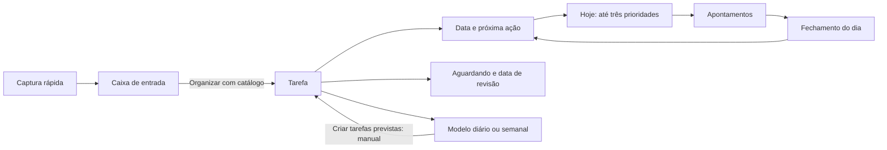

# Planejamento pessoal — New 1.9.0

## Fluxo de uso

O Foco New abre em **Hoje**. **Alt+H** abre esse espaço; **Alt+Q** ou o botão **Captura rápida** leva diretamente à caixa de entrada de qualquer tela.

1. **Capturar:** escreva uma frase (até 1.000 caracteres). Nenhum catálogo, prazo ou cliente é exigido nesse momento.
2. **Organizar:** selecione a atividade cadastrada, escolha cliente/projeto opcionais e revise o detalhamento. O prazo de entrega é opcional. O texto capturado preenche o detalhamento; a captura só é removida após salvar a tarefa, na mesma transação. Novas atividades são cadastradas na tela Cadastros.
3. **Planejar tarefas:** localize a tarefa por cliente, projeto, atividade ou detalhamento. Em **Planejar / próxima ação**, escolha a data de execução, o próximo passo e, se necessário, a dependência e a data para revisá-la.
4. **Meu dia:** selecione até três prioridades por data e ajuste a ordem pelas setas. Outras tarefas planejadas continuam disponíveis. **Iniciar** usa o fluxo existente de apontamentos e troca transacional de tarefa. Planejamentos anteriores não são movidos automaticamente.
5. **Aguardando:** informe de quem/o que depende e quando revisar. A tarefa aparece em Aguardando retorno; datas de revisão vencidas são sinalizadas. Mude o estado quando ela estiver disponível novamente. Concluir ou marcar Aguardando libera sua posição entre as prioridades.
6. **Fechamento do dia:** confira tarefas planejadas ou trabalhadas ainda abertas, registre a próxima ação, consulte as lacunas da Jornada e salve notas da revisão. O link para Jornada abre a mesma data na aba A definir. Salvar a revisão não conclui tarefas, não preenche lacunas e não encerra sessões. Revisões futuras não são permitidas.

**Data de planejamento e prazo de entrega são independentes.** Planejar para amanhã não altera o compromisso de entrega. As três prioridades são um limite para tarefas disponíveis, não uma obrigação diária. Concluir uma sessão também não conclui a tarefa automaticamente.

## Modelos e recorrência

Em **Hoje → Modelos**, crie um modelo a partir de uma tarefa existente. Dê um nome e escolha Sob demanda, Diária, Semanal, Dias úteis, Dias específicos ou Mensal. Recorrências exigem a próxima data, correspondente aos dias escolhidos ou ao dia mensal.

- **Usar modelo:** cria uma tarefa pendente com os dados atuais da origem. Não copia prazo, planejamento, conclusão, histórico ou apontamentos. Planeje a nova tarefa depois.
- **Criar tarefas previstas:** por escolha do usuário, a geração é manual. Cria uma tarefa por modelo vencido, planejada para o dia local atual, sem prioridade. Avança a próxima data para a primeira ocorrência futura, mantendo a cadência configurada. Não cria uma fila por todos os dias perdidos. Cliques repetidos no mesmo dia não repetem essa ocorrência.
- Alterar a tarefa de origem altera os dados usados nas próximas cópias. Remover um modelo preserva as tarefas que ele já criou. Para mudar sua recorrência, use Editar modelo. Pausar/retomar preserva a data; pausados não geram previstas. Origem arquivada bloqueia uso e geração. Regras dos calendários em [Quinta onda](Quinta-onda.md).

## Persistência e API

Novas tabelas aditivas no SQLite, criadas com `IF NOT EXISTS`:

| Entidade | Campos | Relação |
|---|---|---|
| `task_inbox` | id, title, created_at | Captura independente dos catálogos |
| `task_plans` | task_id, planned_date, priority, next_action, waiting_for, review_date | Um planejamento atual por tarefa; `priority=0` indica ausência de prioridade |
| `task_templates` | id, source_id, name, recurrence, next_date | Modelo referenciando a tarefa de origem |
| `template_options` | template_id, paused, weekdays, month_day | Pausa e opções de calendário; ausência mantém modelo legado ativo |
| `daily_reviews` | day, notes, reviewed_at | Uma revisão editável por dia local |

`tasks.state` passa a aceitar Aguardando, mantendo `completed=0`. Novas tabelas fazem parte do backup SQLite existente. Planejamentos e modelos possuem chave estrangeira com remoção em cascata ao excluir sua tarefa de origem; tarefas com apontamentos continuam protegidas pelo fluxo atual.

Rotas em `/api/planning`: GET/PUT `plans`, POST `plans/{id}/move`, GET/POST/DELETE `inbox`, POST `inbox/{id}/convert`, GET/POST/DELETE `templates`, POST `templates/{id}/use`, POST `templates/generate`, GET/PUT `reviews/{day}`. PUT de planejamento usa `plans/{id}`; exclusões usam o id do item. Datas usam ISO local `YYYY-MM-DD`.

A interface acessa essas rotas exclusivamente via `window.foco.request` no preload. Token local e loopback continuam exigidos. A conversão, a atualização de planejamento/estado e a geração de recorrências são transacionais. Leitura de modelos não gera tarefas. Alterações de planejamento são registradas no histórico da tarefa.

## Compatibilidade e verificação

O instalador New 1.9.0 usa sua identidade e diretório próprios. O WPF e os instaladores Stable não são modificados. Como New e Stable compartilham o banco da fork, tarefas criadas na New continuam sendo tarefas nesse banco; somente a New oferece a organização adicional. A Stable antiga não possui o estado Aguardando entre suas opções de edição: use a New para administrar esse fluxo.

Testes cobrem limite e ordem de prioridades, independência do prazo, liberação de prioridade, validação de campos, token, conversão sem perda/duplicação, rollback de conclusão com sessão ativa, geração manual sem acúmulo ou repetição, modelos, revisão persistida e criação idempotente das tabelas em base legada. Vitest cobre captura, falhas, início de tarefa, edição do planejamento, revisão e acesso pela navegação/atalho.
