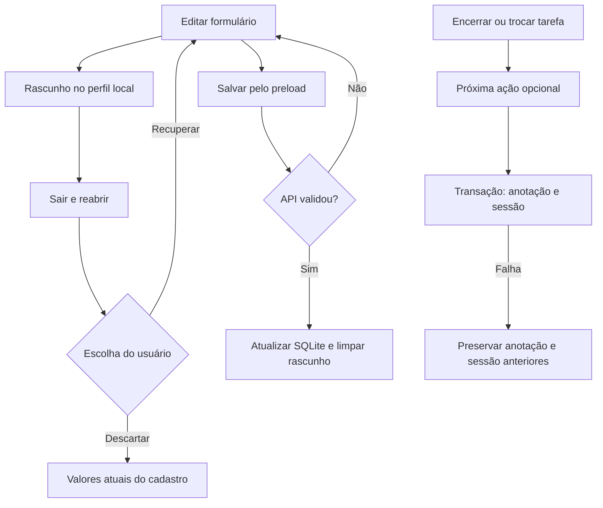

# Primeira onda — New 1.10.0

Escopo autorizado em 01/10/2026: AD-02, OR-07, AD-05 e UX-01. Nenhuma publicação externa. Foco WPF e Stable preservados.

## Retomada de tarefas

Ao encerrar manualmente uma sessão vinculada a uma tarefa, o diálogo oferece a próxima ação existente. Ao iniciar outra tarefa com uma sessão vinculada ativa, o diálogo Trocar tarefa oferece a mesma anotação, além de Cancelar e Trocar tarefa. A anotação pertence à tarefa anterior. Sessões sem tarefa mantêm a troca direta.

O texto é opcional, com até 1000 caracteres. Não editar preserva o texto atual; apagar e confirmar limpa a anotação. Encerramentos automáticos por duração preservam o texto salvo. O fim da sessão não conclui a tarefa. Data planejada, prioridade, dependência, revisão e prazo permanecem intactos.

`finish` e `switch` aceitam `nextAction` opcional. `NextActionService` atualiza somente `task_plans.next_action` e registra a mudança no histórico da tarefa. Finalização e troca são transacionais: falhas ao criar a nova sessão também desfazem a anotação e a interrupção. Não há migração destrutiva.

## Prazo de novas tarefas

Configurações → Novas tarefas → Prazo padrão: Sem prazo (padrão) ou Hoje. A preferência `tasks.defaultDueDate` aceita `empty` e `today`. É aplicada ao abrir Nova tarefa; o usuário pode preencher, alterar ou limpar a data. Tarefas existentes, capturas e modelos não recebem prazos automáticos. Um rascunho recuperado mantém a data digitada nele.

## Rascunhos locais

Os formulários de apontamento, nova/edição de tarefa, edição de sessão, retroativo, captura, organização da captura, planejamento, modelo, próxima ação e notas de fechamento guardam alterações localmente. Ao reabrir, use Recuperar rascunho ou Descartar rascunho. A recuperação nunca salva os dados na API por conta própria. Digitar um novo conteúdo substitui o rascunho anterior desse formulário.

As chaves `foco.draft.v1.*` do localStorage são separadas por formulário e ID, ou por data nas revisões e intervalo inicial nos retroativos de lacunas. O fechamento diário aguarda a revisão salva antes de oferecer recuperação. Sucesso remove o rascunho; falha conserva o conteúdo. Confirmações de sobreposição não são recuperadas. Datas recuperadas devem ser conferidas antes de salvar. Valores são validados novamente pelos formulários e pela API.

Os rascunhos ficam no perfil local do Electron, fora do backup SQLite. Não substituem salvar nem o backup. Conteúdo incompatível/corrompido é ignorado; falha de escrita gera aviso sem bloquear a digitação.

## Acessibilidade e janela compacta

Navegação com nomes e dicas mesmo quando só os ícones aparecem; foco visível nos controles; nome acessível e retorno de foco nos diálogos; atalhos globais internos não navegam atrás de um modal aberto. Captura rápida permanece visível em janela compacta. Ações e títulos podem quebrar linha, gráficos acomodam nomes longos e mensagens ganham contraste no tema escuro.

## Fluxo

## Critérios e validação

- Anotação omitida, explícita vazia, longa demais e falha na troca; planejamento preservado e rollback verificados em Java.
- Prazo vazio padrão e opção Hoje; recuperação explícita, descarte, isolamento, conteúdo inválido, falta de armazenamento e notas após navegação em Vitest.
- Cancelamento da troca, envio da anotação e foco/nome do diálogo em Vitest.
- `npm test`: 56 Java e 107 Vitest aprovados; TypeScript e `npm run build` concluídos.
- Conferência visual e reinstalação registradas em `Doc/Versoes.md` após conclusão.

Conferência visual dos dois temas, teclado e reinstalação concluídas. Dados anteriores preservados; detalhes e backup em [Versões](Versoes.md).
