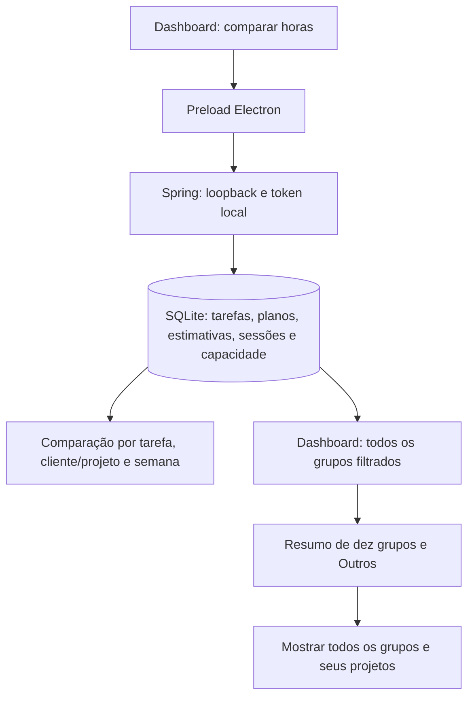

# Quarta onda — New 1.13.0

Escopo autorizado em 02/10/2026: AN-01 e AN-04. A entrega usa dados locais e não modifica apontamentos, estimativas ou planejamento ao consultar.

## AN-01 — comparação de horas

Dashboard → Planejado, estimado e realizado tem filtros próprios de início, fim e base real/arredondada. Abre com segunda-feira até hoje, sem consultar automaticamente. Comparar horas aplica o período; mudanças posteriores ocultam o resultado até uma nova consulta. Falhas exibem mensagem e permitem repetir, sem manter um resultado antigo. O período deve ter de 1 a 366 dias.

Por tarefa, entram tarefas com data planejada no período ou com apontamentos iniciados nele, inclusive concluídas e Aguardando. Estimativa total é o valor atual de OR-02; planejado no período é essa estimativa quando a data planejada está no intervalo. Cada tarefa conta uma vez, independentemente da quantidade de apontamentos. Ausência de estimativa aparece explicitamente e não é uma estimativa de zero. A diferença realizado menos estimativa compara o trabalho do período à estimativa total; não representa saldo restante quando há trabalho fora do período.

Por projeto, o agrupamento inclui cliente para separar projetos homônimos. Tarefas vinculadas usam seu cliente/projeto atual. Estimado soma uma vez a estimativa total de cada tarefa incluída; planejado soma apenas tarefas planejadas no intervalo. As contagens de tarefas sem estimativa acompanham os dois totais. Apontamentos sem tarefa usam seu próprio cliente/projeto, entram no realizado e são destacados em Sem vínculo, sem receber estimativas fictícias.

Vinculado − estimado compara somente o realizado associado a tarefas com o estimado dessas tarefas; planejamentos sem estimativa tornam essa diferença incompleta. Na semana, Realizado − planejado inclui todo o trabalho e destaca separadamente o tempo sem vínculo. Planejado − capacidade mostra excesso positivo ou capacidade disponível negativa; sem estimativas, o resultado é incompleto.

Por semana, segunda-feira inicia cada grupo. Planejado/estimado soma estimativas das tarefas com data planejada na semana e dentro do período selecionado. Realizado soma todos os apontamentos no intervalo, vinculados ou não. Capacidade usa o valor diário atual de OR-02 (padrão 480 minutos), para cada dia selecionado, inclusive fins de semana. Uma semana parcial considera somente os dias selecionados. Capacidade zero é válida; planejamentos sem estimativa deixam a comparação incompleta.

Planejamento mantém somente uma data por tarefa e não guarda uma previsão independente de horas: a carga planejada deriva da estimativa. Estimativas, capacidade e datas planejadas não têm snapshots; mudanças atuais afetam consultas antigas. O painel informa esse limite, sem inventar precisão histórica. Tarefas concluídas continuam incluídas para permitir revisão retrospectiva do planejamento atual.

Apontamentos inteiros são atribuídos à data de início no fuso local do backend, inclusive quando atravessam meia-noite. Horas reais descontam o acréscimo conhecido de arredondamento e preservam o tempo salvo quando faltam dados antigos, conforme AN-03. Sessões ativas mostram somente tempo persistido. Lacunas virtuais A definir não entram na comparação. O painel não expõe valores financeiros e fica fora do PDF do Dashboard.

## AN-04 — distribuição completa

O backend retorna todos os grupos com os mesmos filtros e a mesma base de horas dos totais. A visão resumida apresenta até dez grupos na ordem escolhida e soma o restante em Outros (N grupos). Horas, valores, sessões e quantidade sem preço são preservados nessa soma; percentuais e distribuição usam o total geral, inclusive A definir quando habilitado.

Mostrar todos os grupos exibe cada grupo e permite acessar seus projetos individuais. A escolha é guardada localmente, sem persistir datas. Ordenação define quais dez grupos aparecem no resumo. O PDF acompanha a visão escolhida. Outros é uma soma de distribuição; seus projetos individuais ficam disponíveis ao mostrar todos os grupos.

## Contratos, entidades e fluxo

`GET /api/planning/analysis?from=AAAA-MM-DD&to=AAAA-MM-DD&hoursMode=real|rounded` exige token local e retorna `from`, `to`, `hoursMode`, `tasks`, `projects`, `weeks` e `unlinkedSeconds`. Base padrão: real. Datas inválidas, invertidas, ausentes, período acima de 366 dias e modo desconhecido retornam 400; ausência de token retorna 401.

`tasks`: ID, cliente, projeto, atividade, detalhe, data planejada, estimativa total nullable e segundos planejados/realizados. `projects`: cliente/nome, segundos estimados/planejados/realizados, contagens sem estimativa e segundos sem vínculo. `weeks`: início da semana, segundos planejados/realizados/capacidade, planejamentos sem estimativa e segundos sem vínculo.

Não há nova tabela ou migração. Consulta `tasks`, `task_plans`, `task_estimates`, `sessions` e `settings`. `GET /api/dashboard` passa a retornar todos os grupos; formato do contrato permanece compatível. O renderer compõe a visão resumida após incluir as lacunas compatíveis com os filtros.

## Critérios de aceite

Cobrir múltiplos apontamentos sem duplicar estimativas, tarefas concluídas, sem planejamento ou estimativa, projetos homônimos, apontamentos sem vínculo, exclusão de trabalho fora do período, semanas parciais, capacidade zero, fuso local, horas reais/arredondadas, compatibilidade legada, ausência de escrita, validação e token. Conferir somas de mais de dez grupos com filtros, visão resumida/completa, preferência persistida, falhas de consulta e atualização de filtros. Executar `npm test` e `npm run build`; verificar pacote e interface compacta nos temas claro/escuro.

## Validação — 02/10/2026

`npm test`: 73 testes Java e 130 Vitest aprovados, saída final 0. `npm run build`: TypeScript, Vite, backend e empacotamento concluídos, saída 0. Conferência no Electron com perfil isolado e dados fictícios em 800 × 620, claro/escuro: filtros e três tabelas da análise, resumo com Outros e todos os 14 grupos, sem transbordamento horizontal da janela. Tabelas podem receber foco e rolar horizontalmente com as setas do teclado.

Versão 1.13.0 e presença dos dois recursos conferidas no ASAR; SHA-256 do JAR empacotado igual ao compilado. Instalador: `release/New/Foco-New-Setup-1.13.0.exe`, SHA-256 `066e6763ccea4a8277265a5de9e75aee9fd800e70c8ca23e27e455311bc3d369`. Evidências em `.atualizacao_status/fourth-wave-qa/`; logs de testes/build em `.atualizacao_status/fourth-wave-*.log`. Instalador gerado localmente, sem instalação ou publicação. Dados de uso e Foco WPF preservados.
