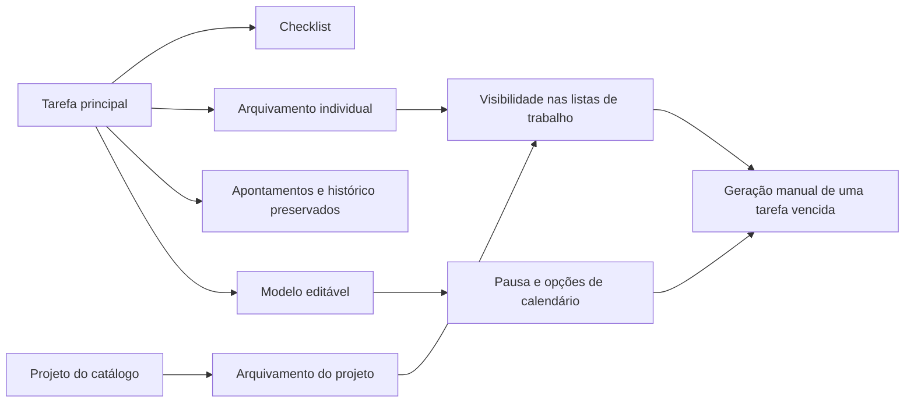

# Quinta onda — organização, New 1.14.0

Escopo escolhido pelo usuário: OR-03, OR-04 e OR-06. Dados locais, geração manual de recorrências, token Spring e comunicação exclusiva pelo preload permanecem como base dos fluxos.

## Checklist dentro da tarefa — OR-03

Abra **Checklist** em Tarefas ou nos cartões de Hoje. Adicione até 100 passos, com texto de até 200 caracteres; marque, desmarque, edite ou remova cada passo. O botão apresenta concluídos/total. Os apontamentos, a estimativa e o prazo continuam na tarefa principal. Marcar todos os passos não conclui a tarefa automaticamente, e concluir a tarefa não altera seus passos.

Alterações do checklist são registradas no histórico da tarefa na mesma transação. Um passo pertence a uma única tarefa e não pode ser alterado usando a rota de outra. Tarefas ou projetos arquivados permitem consultar o checklist, mas exigem restauração para editá-lo. Modelos continuam copiando os campos tradicionais da tarefa; não copiam checklist, prazo, conclusão, planejamento nem apontamentos.

## Arquivar e restaurar — OR-04

Em **Tarefas**, o filtro Arquivamento oferece Ativas, Arquivadas e Todas. **Arquivar tarefa** exige confirmação e mantém apontamentos, passos, histórico, estimativas, datas e notas de planejamento. Um apontamento em andamento ou pausado impede arquivar sua tarefa. Arquivamento é independente de conclusão.

Em **Cadastros → Projetos**, filtre Ativos, Arquivados ou Todos e use **Arquivar projeto** ou **Restaurar projeto**. Os projetos do catálogo são globais por nome; arquivar um projeto afeta tarefas e atalhos desse projeto em todos os clientes. Apontamentos ativos desse projeto, inclusive ligados a tarefas do projeto com outro nome histórico no apontamento, impedem seu arquivamento.

Tarefas arquivadas individualmente ou pertencentes a projetos arquivados saem de Hoje, prioridades, revisão semanal e sugestões de trabalho. Novas tarefas e sessões em projetos arquivados são rejeitadas pela API. Edição de registros históricos e relatórios continuam acessíveis, sem filtros de arquivo nos cálculos existentes. O lançamento retroativo mantém o catálogo completo para registrar fatos históricos.

Arquivar e restaurar removem a prioridade, preservando data e próxima ação. Restaurar não ocupa automaticamente uma vaga entre as três prioridades. Restaurar um projeto não restaura tarefas arquivadas individualmente; restaurar uma tarefa cujo projeto continua arquivado não a torna disponível até restaurar também o projeto.

Renomear um projeto preserva seu arquivamento pela chave estrangeira. Unificar projetos mantém o arquivamento se qualquer origem estiver arquivada e remove as prioridades afetadas; apontamentos ativos impedem essa unificação. Os cálculos de Dashboard, relatórios/CSV e análise histórica de planejamento permanecem inclusivos.

## Editar e pausar recorrências — OR-06

Em **Hoje → Modelos**, **Editar modelo** altera nome, tarefa de origem, frequência e próxima data, mantendo o identificador do modelo e as tarefas já geradas. **Pausar recorrência** impede a geração de previstas; **Retomar recorrência** habilita-a mantendo a data configurada. Um modelo pausado ainda pode ser usado manualmente. Um modelo cuja origem está arquivada continua visível/editável, mas não pode ser usado nem gerar previstas até a origem e seu projeto estarem disponíveis.

| Frequência | Próxima ocorrência futura após gerar |
|---|---|
| Sob demanda | Sem data nem geração de previstas |
| Diária | Dia seguinte ao dia local atual |
| Semanal | Primeira data futura mantendo a cadência da data configurada |
| Dias úteis | Próxima segunda a sexta; não considera feriados |
| Dias específicos | Próximo dia escolhido, de segunda a domingo |
| Mensal | Dia escolhido no próximo mês aplicável; meses curtos usam seu último dia |

Datas de dias úteis/específicos precisam corresponder a um dia selecionado. Mensal exige dia de 1 a 31 e data correspondente; uma recorrência no dia 31 usa 28/29 em fevereiro e volta ao dia 31 em março. Tudo usa a data local do sistema.

**Criar tarefas previstas** continua sendo uma ação manual. Gera no máximo uma tarefa por modelo vencido, planejada para hoje, e avança a data até a primeira ocorrência futura. Dias perdidos não geram acúmulo; repetir a ação no mesmo dia não duplica a ocorrência. Modelos pausados ou com origem arquivada não avançam sua data. Ao retomar após atraso, a próxima geração cria uma única tarefa para hoje.

## Entidades, API e compatibilidade

As quatro tabelas novas são aditivas e integram o backup SQLite existente:

| Tabela | Campos principais | Relação |
|---|---|---|
| `task_checklist` | id, task_id, title, completed, position | Passos da tarefa; remoção em cascata ao excluir tarefa sem apontamentos |
| `task_archive` | task_id, archived_at | Arquivamento individual sem alterar estado ou sessões |
| `project_archive` | name_key, archived_at | Projeto do catálogo; chave acompanha renomeações |
| `template_options` | template_id, paused, weekdays, month_day | Opções do modelo; ausência equivale a modelo legado ativo |

Rotas novas: GET/POST `/api/tasks/{id}/checklist`, PUT/DELETE `/api/tasks/{id}/checklist/{stepId}`, PUT `/api/tasks/{id}/archive`, PUT `/api/catalogs/projects/{name}/archive`, PUT `/api/planning/templates/{id}`. Arquivamento recebe `{archived: true|false}`. A lista `/api/tasks` aceita `archive=active|archived|all`, com padrão `active`; o aplicativo solicita `all` e aplica filtros conforme cada fluxo. Campos novos de tarefa: `archived`, `projectArchived`, `checklistTotal`, `checklistCompleted`. Catálogo acrescenta `archivedProjects`; modelos acrescentam `paused`, `weekdays`, `monthDay` e `sourceArchived`.

Modelos antigos continuam diária/semanal/sob demanda, sem pausa e sem reescrever registros. Nenhuma tarefa ou projeto existente é arquivado durante a atualização. As versões Stable anteriores compartilham o banco da fork, mas não reconhecem o arquivamento ou as opções novas de recorrência; administre essas funções na New. O Foco WPF é preservado.

## Critérios de aceite e validação

Checklist deve persistir sem alterar duração, prazo ou conclusão; arquivamento deve ser reversível sem mudar totais históricos; apontamentos ativos devem impedir arquivamento; edição/pausa e novos calendários devem manter geração manual sem duplicações nem acúmulo. Falhas de histórico devem reverter a transação.

Testes Java cobrem esses critérios, isolamento de passos por tarefa, proteção por token, nomes Unicode, renomeação/unificação de projetos e compatibilidade do esquema aplicado duas vezes. Vitest cobre os fluxos, confirmação, falhas sem perda do formulário, filtro de arquivadas, consulta de checklist arquivado e edição mensal/dias específicos. Resultados finais, empacotamento e conferência visual serão registrados em `Doc/Versoes.md`.
