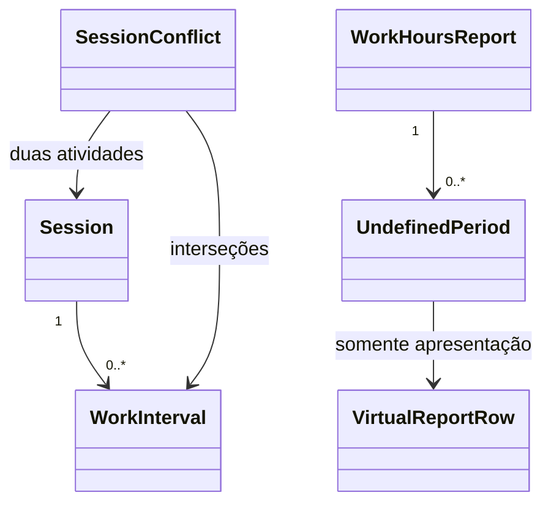
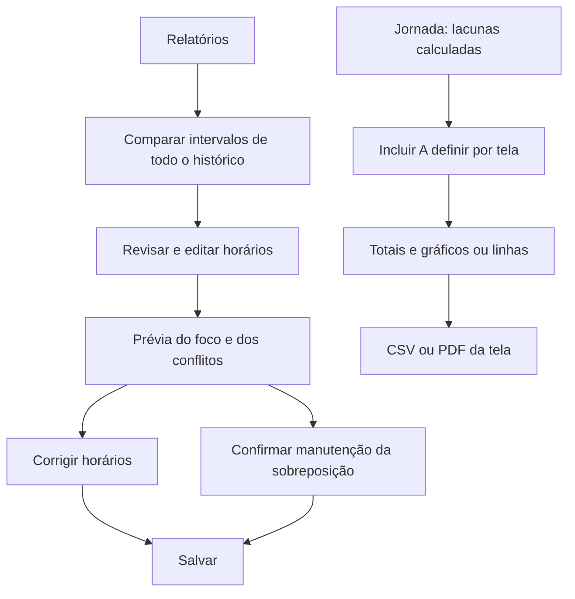

# Revisão de horários e visibilidade de A definir

## Contrato funcional

- Relatórios marca conflitos, oferece o filtro **Somente horários conflitantes** e apresenta os pares, a duração sobreposta e os trechos envolvidos.
- A comparação consulta o histórico completo: uma atividade fora dos filtros ainda pode conflitar com uma atividade exibida.
- Intervalos precisos respeitam pausas e retomadas. Registros sem intervalos precisos são identificados como estimados. Intervalos adjacentes não conflitam.
- A revisão compara foco somado e tempo ocupado sem duplicar intervalos. Não desconta tempo de nenhuma atividade automaticamente; a Jornada mantém suas regras anteriores.
- **Revisar** abre a edição. Alterar horários apresenta a duração recalculada. Salvar com conflito exige marcar **Confirmo manter a sobreposição destes horários**. Uma mudança no período exige nova confirmação.
- A confirmação autoriza aquele salvamento; não elimina o aviso de conflito nem constitui um histórico de auditoria. Sessões em andamento ou pausadas devem ser encerradas antes da revisão de horários.

## Dashboard e Relatórios

**Incluir tempo A definir** começa desligado e lembra a escolha separadamente em cada tela. Ligado, inclui as lacunas calculadas pela Jornada nos totais, na listagem/gráficos e na exportação da tela (CSV/PDF). Desligado, retira esse tempo desses resultados. A apuração original da Jornada não muda.

Lacunas são globais, sem cliente, projeto, consultor ou preço. Filtros desses campos as excluem; busca por A definir e filtros de data/duração são respeitados. Categoria e resultado de sessões não são aplicáveis às lacunas. No Dashboard elas formam **A definir (jornada)**; não aumentam o número de sessões nem valores financeiros. No CSV, o resultado é identificado como A definir, com valores financeiros vazios. A exportação de uma seleção contém apenas as linhas selecionadas.

As lacunas são linhas calculadas, sem criação de sessões no banco. Podem ser selecionadas para exportação, mas não editadas, excluídas ou modificadas em lote. Exportação fica indisponível enquanto a consulta carrega ou apresenta erro.

## Entidades e arquitetura

`Session` possui intervalos `WorkInterval` (um para muitos). `GET /api/work-hours/intervals`, protegido pelo token local, expõe início, término, última marcação e precisão. O renderer recebe tudo pelo preload existente. `conflicts.ts` compara a interseção dos intervalos e calcula sua união para mostrar o tempo ocupado.

`UndefinedPeriod` continua vindo de `GET /api/work-hours`; `undefinedTime.ts` o transforma em linha virtual somente para consulta/exportação. `useUndefinedTime` guarda `foco.dashboard.includeUndefined` e `foco.reports.includeUndefined` no armazenamento local da interface. Não há migração de dados.

## Validação esperada

Testes cobrem sobreposição parcial, adjacência, três atividades, pausas precisas, intervalos ativos/inválidos, confirmação e correção, filtros que não atribuem lacunas a clientes, persistência independente, proteção das linhas virtuais, totais e exportações, falha de consulta e autenticação do endpoint. Resultados da execução completa serão registrados no Roadmap após a validação.
