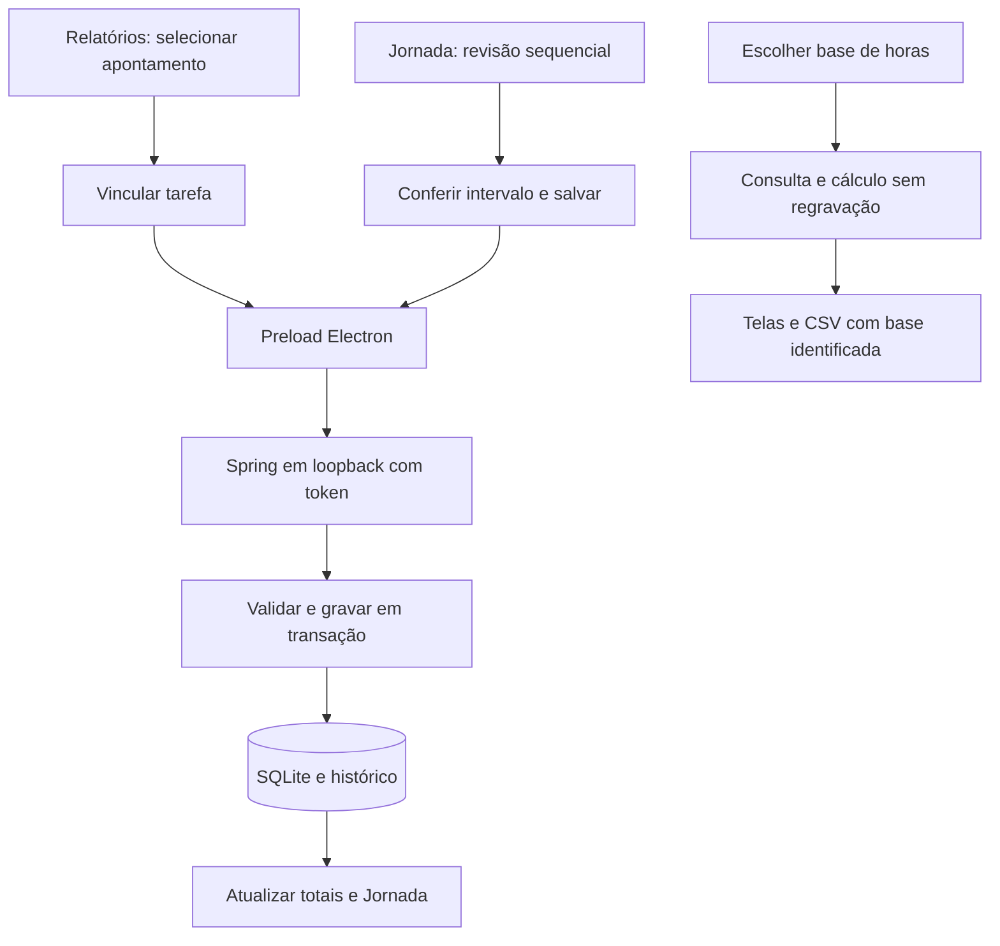

# Segunda onda — New 1.11.0

Escopo autorizado em 02/10/2026: AN-03, AP-01, AP-02 e UX-02. Os demais candidatos do Roadmap continuam em avaliação.

## Horas consistentes

Tarefas e Relatórios oferecem **Horas exibidas: Reais / Arredondadas**, com Arredondadas como padrão inicial. Em Relatórios, escolha o modo e pressione Atualizar: totais, ordenação por foco/custo, filtros de horas/valores e CSV usam a base aplicada. Uma atualização pendente ou com falha impede a exportação. **Término exibido** é uma escolha independente, também levada ao CSV. O CSV identifica `Base_horas`, `Base_termino` e categoria.

Horas reais subtraem somente o acréscimo registrado entre término real e arredondado, preservando pausas. Legados sem precisão recuperável conservam o tempo salvo; lacunas A definir conservam sua duração e não recebem custo. Nenhum apontamento é regravado pela escolha da base. O backend compartilha a expressão de cálculo entre Dashboard, filtros de sessões e agregados de tarefas. A lista de sessões continua devolvendo `focusSeconds` original, para edição e cronômetro; a interface calcula a duração exibida separadamente. Tarefas recebem também `realFocusSeconds`.

## Corrigir vínculo

Em Relatórios, selecione um apontamento finalizado e clique em **Vincular tarefa**. Escolha outra tarefa ou Sem tarefa vinculada e salve. Tarefas concluídas também aceitam vínculos históricos. Sessões em andamento, pausadas e lacunas virtuais não aceitam essa ação.

Somente `sessions.task_id` muda. Horários, foco, tarifa, classificação e estado permanecem iguais. Totais das tarefas de origem e destino são recalculados; o histórico registra o antes/depois do apontamento e das tarefas afetadas na mesma transação. Vínculo já existente não produz histórico duplicado. Falha no histórico desfaz a operação. A edição geral rejeita mudanças de vínculo: a ação própria é o caminho para essa correção.

## Revisar lacunas

Em **Jornada → A definir → Revisar em sequência**, use Anterior e Próxima para conferir cada intervalo. Navegar não grava apontamentos. Os rascunhos existentes permitem recuperar explicitamente alterações ao voltar a uma lacuna.

**Reaproveitar a classificação do último lançamento salvo** começa desmarcado. Quando ativado, preenche tarefa, cliente, projeto, atividade, detalhamento, consultor, card, categoria, resultado e tarifa no próximo formulário. Não copia horários, duração nem confirmação de sobreposição. Cada intervalo exige Salvar lançamento. Ao salvar parte de uma lacuna, os trechos restantes continuam na revisão. O lançamento retroativo mantém a regra de ao menos um minuto de foco; intervalos menores podem ser inspecionados e pulados.

A revisão confere novamente se o intervalo está disponível antes de enviar. O backend também valida a lacuna na transação de criação; intervalos já preenchidos são rejeitados. Falhas preservam o formulário. Após sucesso, a fila remove o trecho salvo e a Jornada é atualizada. A fila é local à revisão, sem preenchimento automático de tempos.

## Preferências locais

O armazenamento local do renderer usa chaves `foco.view.v1.*`, validadas na leitura. São lembrados base de horas por tela, término de Relatórios, agrupamento e projetos expandidos no Dashboard e ordenação/direção em Tarefas, Relatórios, Dashboard e Jornada. Datas e buscas não são persistidas por essa preferência; as telas reabrem com datas atuais. Dados inválidos retornam ao padrão. Essas preferências pertencem ao perfil Electron e não integram o backup SQLite.

## Contratos e fluxo

- `PUT /api/sessions/{id}/task`: `{taskId: string | null}`; operação transacional com histórico.
- `POST /api/sessions/retroactive/gap`: mesmos campos do retroativo, com validação transacional de disponibilidade.
- `GET /api/sessions?hoursMode=real|rounded`: aplica base aos filtros numéricos, preservando o foco retornado.
- `GET /api/sessions/export.csv?hoursMode=real|rounded&endMode=real|rounded`: identifica e aplica as duas bases.
- `GET /api/tasks`: acrescenta `realFocusSeconds`; mantém `focusSeconds` compatível.

Não há novas tabelas nem migração destrutiva. Preload Electron, token local e loopback continuam obrigatórios. Foco WPF e seus dados permanecem preservados.

## Critérios de aceite

Testes devem cobrir horas com pausas, legados e lacunas; custos e CSV; filtros e base inválida; mudança/remoção de vínculo, tarefa concluída, sessão ativa, token e rollback; navegação sem gravação, reaproveitamento opcional, falha e intervalo já preenchido; preferências recuperadas sem datas antigas. Validação de entrega: `npm test`, `npm run build`, conferência do pacote e inspeção visual isolada.

## Validação da entrega — 02/10/2026

`npm test`: 61 testes Java e 117 Vitest aprovados. `npm run build` gerou `release/New/Foco-New-Setup-1.11.0.exe`; TypeScript e Vite concluíram. `git diff --check` passou. Conferência visual com dados fictícios e perfil Electron isolado em 800 × 620, temas claro/escuro: Relatórios, vínculo, revisão sequencial e Tarefas; sem transbordamento horizontal da página, foco contido no diálogo e restauração ao fechar com Escape.

Versão 1.11.0 conferida no ASAR e SHA-256 do JAR empacotado igual ao compilado. Evidências locais em `.atualizacao_status/second-wave-qa/`. Instalador produzido localmente; não houve instalação nem publicação. Os testes e a inspeção usaram bases/perfis isolados, sem alterar os dados de uso ou o Foco WPF.
