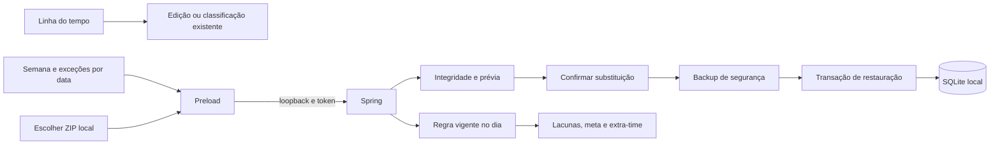

# Sétima onda — New 1.16.0

AP-03, AP-04 e CF-01 autorizadas em 06/10/2026. Esta entrega conclui os 24 itens da tabela de melhorias; pendências históricas de distribuição/validação são acompanhadas separadamente.

| Item | Critérios de aceite |
|---|---|
| AP-03 | Linha do tempo em Jornada, com data e navegação diária, sessões, pausas precisas, períodos estimados e A definir. Intervalos podem abrir a edição existente; sessões ativas/pausadas não são editáveis. Horários locais, cortes em meia-noite, sobreposições em linhas separadas e controles por teclado. Não inventar pausas de legados. |
| AP-04 | Semana de segunda a domingo com até oito intervalos diários, dias de folga e exceções por data. Versionar por data de vigência, permitir salvar/editar/remover somente hoje ou datas futuras. Históricos anteriores conservam regra antiga. Meta calculada pela soma dos intervalos, usada no extra-time; lacunas usam os mesmos horários. Capacidade de planejamento permanece independente. |
| CF-01 | Escolher ZIP local no Electron, verificar manifesto, integridade, vínculos e compatibilidade do banco; exibir conteúdo antes de confirmar. Revalidar SHA-256 ao aplicar. Bloquear restauração com sessão atual ativa/pausada, criar backup de segurança e substituir SQLite em transação, com rollback em falhas. Sessões abertas no backup voltam pausadas. Testar somente em bases isoladas. |

Regras em `work_schedule_rules` e exceções em `work_schedule_exceptions`, ambas cobertas pelo ZIP SQLite. Datas sem regra nova conservam o padrão histórico (lacunas em dias úteis 09h–12h/13h–18h e meta de 8h). Novas folgas têm meta zero. Intervalos cruzando meia-noite devem ser configurados em dias separados. Mudanças no dia atual podem recalcular esse dia; dias anteriores são imutáveis pela interface/API.

Restauração aceita backups SQLite compatíveis e tabelas opcionais ausentes, que ficam vazias, usando valores padrão para colunas opcionais antigas. Esquema futuro/desconhecido ou coluna obrigatória ausente é rejeitado. Limites: ZIP 512 MiB, banco descompactado 256 MiB. Somente `foco.db` e manifesto são lidos; caminhos do ZIP não são extraídos. A cópia de segurança fica na pasta `restore-safety` ao lado da pasta de dados. Perfil Electron, rascunhos, visões salvas e estado diário de lembretes não integram o backup SQLite. Após sucesso, o diálogo mostra a cópia anterior e exige atualizar a interface. A restauração sincroniza preferências de atalho/lembretes no processo Electron.

Validação exigida: Java/Vitest com casos válidos, negativos e rollback; `npm test`, `npm run build`, pacote conferido, interface compacta em claro/escuro e limpeza de intermediários. Nenhuma restauração será executada nos dados de uso durante o desenvolvimento.

## Validação concluída

`npm test` aprovado: 101 Java e 169 Vitest. Os testes novos verificam vigência/feriado, histórico idêntico, horários inválidos e acesso sem token; prévia HTTP, esquema antigo, valores incompatíveis, IDs/datas inválidos, confirmação, hash, sessão atual aberta, sessão restaurada pausada, falha da cópia anterior e rollback após erro de inserção. Vitest verifica cortes em meia-noite local, pausas/legados, sobreposições em linhas separadas, ações de edição/classificação, navegação diária, regras/exceções, retenção dos campos em falhas, prévia/confirmação, nomes de conteúdo e recibo de restauração.

`npm run build` final aprovado; ASAR 1.16.0 e main/preload/controlador iguais ao fonte, recursos presentes, JAR igual ao compilado e manifestos conferidos. JAR final testado em banco vazio isolado: configuração de jornada e folga, backup/prévia/restauração reais, integridade, conteúdo anterior no backup de segurança e rejeição de hash alterado. O processo foi encerrado após o teste.

Conferência visual isolada em Electron com dados simulados: dez capturas, 800 × 620, claro/escuro, edição pela linha do tempo, configuração de jornada, prévia e recibo. Sem rolagem horizontal e `errors=[]`; Tab contido e Escape cancelando a prévia sem restaurar. Evidências em `.atualizacao_status/seventh-wave-qa/`, `seventh-wave-tests.log`, `seventh-wave-build.log` e `seventh-wave-smoke.json`.

Limpeza: 171 arquivos e 611.333.101 bytes (583 MiB), mantendo instaladores atuais/em uso, código, dados e backups. Detalhes em [Limpeza](Limpeza.md). New 1.16.0 instalada e reaberta após solicitação do usuário, com versão/hashes conferidos e 262 sessões preservadas; as duas novas tabelas foram criadas vazias. Detalhes em [Instalação](Instalacao.md). Sem publicação desta onda. Artefato/hash em [Versões](Versoes.md).
