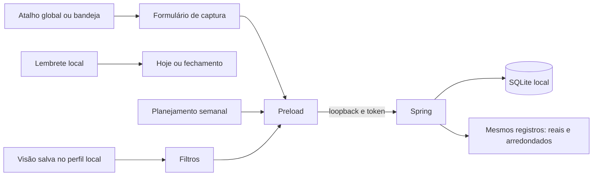

# Sexta onda — New 1.15.0

Escopo autorizado em 06/10/2026: AN-02, OR-05, AD-01, AD-03 e OR-01.

| ID | Entrega e critérios de aceite |
|---|---|
| AN-02 | Dashboard e Relatórios exibem horas reais, arredondadas e diferença dos mesmos registros filtrados. Registros históricos sem os dois términos são contados e mantêm o tempo salvo; sessões abertas são identificadas como provisórias. Lacunas não recebem arredondamento. PDF do Dashboard inclui a comparação. |
| OR-05 | Tarefas, Relatórios e Dashboard permitem nomear, aplicar, atualizar, renomear e excluir visões locais de filtros e ordenação. Períodos Hoje/Semana atual são recalculados ao aplicar; datas fixas exigem escolha explícita. Falhas de armazenamento não exibem sucesso. |
| AD-01 | Atalho global configurável e desativável, com aviso de conflito. Menu da bandeja oferece captura. Janela oculta/minimizada é exibida e recebe foco, com formulário de captura que preserva formulários já abertos. Encerramento libera o atalho. |
| AD-03 | Lembretes opcionais de planejamento e revisão em horários locais, enquanto o app está aberto ou na bandeja. Notificação e painel local oferecem abrir, adiar 15 minutos, dispensar e silenciar hoje. Evitar repetição após reiniciar; não recuperar notificações vencidas há mais de 15 minutos nem acumular dias perdidos. |
| OR-01 | Visão de segunda a domingo, com estimativas/capacidade e tarefas sem data. Mover por arraste ou formulário acessível por teclado; preservar prazo, próxima ação, dependência e estado. Prioridade pode ser preservada por escolha explícita, com limite de três por dia. Falhas não aparentam mudança concluída. |

Os dados continuam locais, a interface chama a API pelo preload, o backend exige token e permanece em loopback. Novas preferências usam a tabela `settings`; planejamento reutiliza `task_plans`; a promoção não altera registros antigos. Visões são armazenadas no perfil local do Electron. Estado diário de notificações fica em `workflow-reminders.json` no diretório de dados; configurações fazem parte do backup SQLite, mas visões do perfil e estado diário não integram esse backup.

Validação exigida: testes Java dos contratos, filtros, precisão e transações; Vitest de visões, planejamento, captura e lembretes com relógio/controladores simulados; `npm test`, `npm run build`, conferência dos arquivos do pacote e limpeza de intermediários sem remover dados/backups ou instaladores em uso.

## Resultados de validação

`npm test` aprovado: 91 Java e 160 Vitest. Além dos contratos novos, os testes verificam legados, filtros de horas, rollback de histórico, limite de prioridades, preferência inválida sem escrita parcial, períodos relativos, armazenamento indisponível, captura já salva com falha de atualização, formulários preservados e entrega/adiamento/silêncio dos lembretes através de reinícios e viradas de dia.

Conferência visual isolada em Electron, dados de demonstração, janela 800 × 620 e temas claro/escuro: 14 capturas, sem rolagem horizontal da página/diálogos, foco no campo de captura, Tab contido no diálogo superior, Escape preservando o formulário anterior e seu rascunho. O primeiro teste visual apontou foco incorreto na captura; corrigido com foco explícito após `showModal`. A execução final terminou com `errors=[]`. As notificações, o registro do atalho e o relógio são simulados nos testes automatizados; entrega efetiva pelo Windows depende das preferências do sistema.

O usuário relatou uma janela “Uncaught Exception” durante a validação e informou que a fechou, sem fornecer o texto. A mensagem original não foi identificada nem atribuída a uma causa específica. Os testes visuais finais não reproduziram exceções. O lançador de QA agora aguarda o Electron oculto, redireciona os dois fluxos para arquivos e registra falhas sem imprimir em pipes já encerrados.

Uma tentativa de testes Java simultâneos ao build interferiu nas classes de `backend/target`; a execução foi descartada e refeita em sequência, com resultado aprovado. Relatórios finais em `.atualizacao_status/sixth-wave-tests.log` e `sixth-wave-qa/result.json`.

`npm run build` final aprovado. ASAR 1.15.0, presença dos quatro conjuntos de textos de interface, controlador local idêntico ao fonte, JAR idêntico ao compilado e manifesto SHA-512/tamanho conferidos. Backend empacotado iniciado com Java real e banco vazio isolado: HTTP 200 em saúde e tarefas autenticadas, 401 sem token e comparação vazia correta; processo terminado após o teste. Artefato e SHA-256 em [Versões](Versoes.md).

Limpeza final: 142 arquivos e 461.745.457 bytes removidos, com hashes dos quatro instaladores atuais/em uso e dos seis backups preservados. Detalhes em [Limpeza](Limpeza.md). O instalador New 1.15.0 foi entregue localmente e, após solicitação do usuário, reinstalado e aberto: saída 0, hashes conferidos, backup e 18 tabelas preservadas, janela respondendo e backend saudável. Detalhes em [Instalação](Instalacao.md). Sem publicação desta versão.
