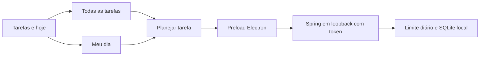

# Tarefas e hoje — New e Stable 1.18.0

Entrega de 07/10/2026, baseada na New 1.17.0. A navegação única **Tarefas e hoje** reúne Meu dia, Todas as tarefas, captura, planejamento diário/semanal, fechamento, revisão semanal e modelos. Alt+H abre Meu dia; Alt+T abre Todas as tarefas. A lista mantém criação, edição, histórico, checklist, arquivamento, filtros, visões salvas e início do cronômetro. O botão Planejar abre o mesmo diálogo de data/prioridade/próxima ação usado pelo planejamento.

Em Configurações → Prioridades do dia, o usuário escolhe entre 1 e 100 atividades prioritárias por data, com padrão **5**, conforme solicitado. A API valida antes de gravar qualquer preferência. O limite aplica-se tanto à priorização quanto à mudança de data com prioridade. Reduzir o limite não exclui prioridades anteriores: elas continuam visíveis e editáveis; novas prioridades só entram quando houver vaga. Concluídas, aguardando e arquivadas não ocupam vagas.

O filtro de estados usa caixas de seleção independentes, acessíveis pelo teclado e sem Shift. Limpar estados volta a mostrar todos os estados. O seletor de estado da tarefa tem formato arredondado e indicação visual de estado, mantendo seu nome acessível e as regras de transição da API.

Projetos novos recebem uma semente aleatória persistida em `catalog_projects.color_seed`. Marcadores e gráficos usam a mesma semente. Quando o cliente tem cor personalizada, o projeto usa uma variação dessa cor; sem ela, recebe uma cor automática. Renomear preserva a semente; unificar conserva a cor do destino. Projetos antigos mantêm a aparência anterior. O campo opcional é acrescentado de forma idempotente aos bancos anteriores.

New e Stable continuam compartilhando o banco local existente. As instalações e primeiras aberturas são verificadas em sequência, com backup anterior; ambas recebem o mesmo frontend e backend validados. A publicação Stable distribui apenas código e instaladores, sem bancos, backups ou logs locais.
