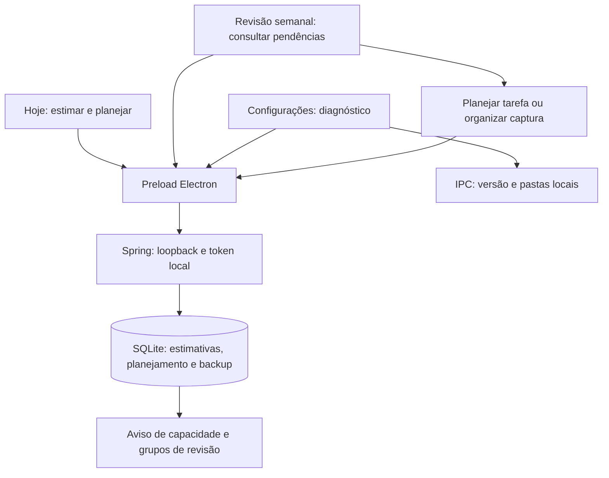

# Terceira onda — New 1.12.0

Escopo autorizado em 02/10/2026: CF-02, OR-02 e AD-04, conforme a sequência proposta e o pedido de implementação. Os demais candidatos permanecem em avaliação.

## CF-02 — diagnóstico local

Configurações → Versão e diagnóstico local mostra canal, versão obtida do Electron, plataforma, comando Java configurado e pastas de dados/logs. Não se trata de uma verificação da versão do Java nem da integridade do banco. Atualizar diagnóstico consulta novamente as informações locais, sem enviá-las a serviços externos.

O painel distingue a data/resultado da última tentativa de backup da data/destino do último sucesso. Falhas manuais e automáticas são registradas; verificações em que o intervalo ainda não terminou não substituem o resultado. Registros antigos sem informação de tentativa aparecem como Sem registro. O último sucesso permanece disponível após falhas posteriores.

## OR-02 — estimativas e capacidade

Hoje → Meu dia e Planejar tarefas oferecem Estimativas e capacidade do dia. Escolha uma tarefa aberta, informe minutos e pressione Salvar estimativa. Valores inteiros de 1 a 100000 são aceitos; vazio remove a estimativa. A estimativa representa o trabalho total da tarefa, sem desconto automático de apontamentos anteriores.

A capacidade diária padrão é de 480 minutos e pode ser configurada de 0 a 1440 minutos. Vale para qualquer data selecionada; não altera as regras de jornada ou Extra-time. O painel soma estimativas das tarefas não concluídas e que não estão Aguardando, planejadas para a data selecionada. Tarefas sem estimativa são contadas separadamente e tornam o total incompleto. Exceder a capacidade mostra o excesso em minutos e permite continuar planejando. Datas planejadas e prazos permanecem independentes.

Estimativas e capacidade ficam no SQLite e integram os backups. Dados antigos começam sem estimativa. A nova tabela é aditiva e idempotente; alteração/remoção de estimativa registra histórico na mesma transação. Falhas preservam o valor persistido e o formulário. Não há geração automática de tarefas.

## AD-04 — revisão semanal

Hoje → Revisão semanal usa o dia de planejamento como data de referência e identifica a semana de segunda a domingo. O painel reúne pendências acumuladas até essa data:

- Capturas com pelo menos sete dias, com acesso à caixa de entrada para organizar.
- Tarefas abertas sem próxima ação, com acesso ao diálogo de planejamento.
- Planejamentos anteriores ao dia selecionado, de tarefas disponíveis, sem apontamento com foco positivo entre a data planejada e o dia selecionado. Trabalho anterior ao planejamento não elimina a pendência.
- Tarefas Aguardando com data de revisão vencida ou no dia selecionado.

Concluídas não entram nos grupos de tarefas. Uma tarefa pode aparecer em mais de um grupo. Apenas abrir a revisão não grava, conclui nem reagenda tarefas. Datas de início dos apontamentos e capturas são convertidas para o fuso local do backend. O painel é uma consulta de pendências; não cria um registro persistido de revisão semanal.

## Contratos e entidades

- `GET /api/planning/estimates`: lista `{taskId, minutes}`.
- `PUT /api/planning/estimates/{id}`: `{minutes: inteiro | null}`; valida tarefa, persiste e registra histórico transacional.
- `PUT /api/settings`: `planning.capacityMinutes`, string inteira de 0 a 1440.
- `GET /api/planning/weekly-review?day=AAAA-MM-DD`: semana, capturas antigas e IDs dos três grupos de tarefas.
- IPC `foco:app-info`: informações do aplicativo pelo preload; não expõe o token.
- `task_estimates`: `task_id` PK/FK de `tasks` com exclusão em cascata; `minutes` inteiro obrigatório, entre 1 e 100000.
- `settings`: acrescenta `planning.capacityMinutes`, `backup.lastAttemptAt`, `backup.lastResult` e `backup.lastMessage`.

## Critérios de aceite

Cobrir persistência e remoção de estimativa, limites e números fracionários, token, tarefa inexistente, rollback de histórico, capacidade zero e limites, migração repetida preservando dados legados, grupos da revisão em datas locais e ausência de gravação ao consultar, sucesso/falha/intervalo de backup, falha de salvamento no formulário e navegação da revisão. Executar `npm test`, `npm run build`, conferir pacote e interface compacta em claro/escuro.

## Validação — 02/10/2026

`npm test` passou com 68 testes Java e 124 Vitest. `npm run build` gerou `release/New/Foco-New-Setup-1.12.0.exe`; TypeScript, Vite e empacotamento concluíram. Conferência visual com dados fictícios em perfil Electron isolado, 800 × 620, temas claro/escuro: capacidade, revisão semanal, planejamento e diagnóstico sem transbordamento horizontal. A conferência revelou a saída do foco nas extremidades do diálogo; `Dialog` agora trata Tab/Shift+Tab explicitamente, com teste e verificação no Electron. Escape restaura o foco ao botão de origem.

Versão 1.12.0 conferida no ASAR e SHA-256 do JAR empacotado igual ao compilado. Evidências em `.atualizacao_status/third-wave-qa/`. Instalador gerado localmente; não foi instalado nem publicado. Testes usam bancos/perfis isolados e preservam os dados de uso e o Foco WPF.
