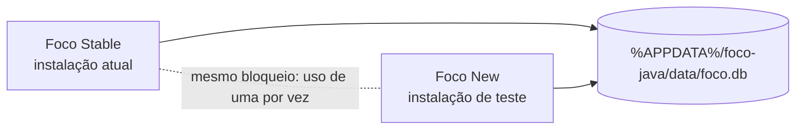

# Versões Stable e New

## New e Stable 1.18.0 — 07/10/2026

Área única Tarefas e hoje, limite diário configurável (padrão 5), filtro de estados sem Shift e cores persistentes para projetos novos. Stable também incorpora as entregas New 1.15–1.17. [Regras e fluxos](Tarefas-e-hoje.md).

`npm test`: 124 Java e 176 Vitest aprovados; `npm run build` e `npm run build:stable` concluídos. 28 capturas em Electron, 1440 × 960 e 800 × 620, claro/escuro, teclado, filtros múltiplos e novos seletores conferidos. Backend empacotado testado em banco isolado: padrão 5, alteração/redução do limite, migração opcional preservando tarefas, HTTP 200 de saúde e 401 sem token.

Frontend ASAR idêntico entre canais. Todas as 266 entradas dos JARs têm conteúdo idêntico; os hashes dos arquivos JAR diferem por metadados do empacotamento. Manifestos `latest.yml`, SHA-512/tamanho e `SHA256SUMS.txt` conferidos.

New e Stable 1.18.0 instaladas nas pastas existentes, com saída 0 e executáveis 1.18.0.0. ASAR/JAR de cada instalação iguais ao pacote por SHA-256. Ambas abertas e verificadas em sequência, com janela respondendo e backend HTTP 200/401. Stable deixada aberta ao final. Antes das instalações, backup SQLite verificado; as 20 tabelas e todos os 274 apontamentos preservados. Apenas o campo opcional `catalog_projects.color_seed` foi adicionado; projetos antigos continuam nulos. Preferências funcionais e histórico mantidos.

New: `release/New/Foco-New-Setup-1.18.0.exe`, 148541391 bytes; SHA-256 `522f8b531c6bab7fa9bfd237f42f335efbe13eea6dd490ce7814e434f02d5d7b`.

Stable: `release/Stable/Foco-Stable-Setup-1.18.0.exe`, 148603779 bytes; SHA-256 `be20b17b2534219ffc31236444a20f7ee0342855e0dd585fef66242970ac50da`.

Publicação Stable 1.18.0 autorizada e preparada; será executada após o envio do código validado à main.

## New 1.17.0 — interface e blocos de 2 minutos — 06/10/2026

Interface expressiva com superfícies, gradientes, botões com relevo, transições e indicador de foco animado. Encerramentos e trocas de tarefas usam blocos de 120 segundos; histórico recuperável convertido uma vez com backup anterior, transação e auditoria. Legados sem precisão identificados e preservados. Regras e limites em [Interface e arredondamento](Interface-e-arredondamento.md).

`npm test`: 119 Java e 173 Vitest aprovados; `npm run build` concluído. Conferidos ASAR, main/preload/controlador iguais ao fonte, recursos visuais/regra na interface, JAR empacotado igual ao compilado, tamanho/SHA-512 de `latest.yml` e manifesto SHA-256.

34 capturas em Electron, 1440 × 960 e 800 × 620, claro/escuro: sem erros JavaScript, rolagem horizontal ou rolagem duplicada do diálogo. Tema escuro do sistema, movimento reduzido, impressão, foco no título, Tab contido e Escape devolvendo foco validados. Backend empacotado em base isolada confirmou token (401 sem autenticação), conversão 600 → 480 segundos mantendo 420,5 segundos reais, legado de 300 e retroativo de 181 preservados, cópia anterior com 600 segundos, novo encerramento 121 → 240 e reabertura idempotente com integridade `ok`.

Instalador local `release/New/Foco-New-Setup-1.17.0.exe`: 148.538.829 bytes, SHA-256 `b3eafb35cfb0c8461f075be8811533571b82b344e7e6e0685409aa70defba172`. JAR SHA-256 `3a18f4c5a82799f6fe8c781f432cdbc9d3b0779514676ecbc12bbbffa38c4712`. Evidências em `.atualizacao_status/experience-*`.

New 1.17.0 instalada e aberta por solicitação do usuário: saída 0, versão 1.17.0.0 e hashes conferidos. Backup prévio verificado; 266 sessões preservadas, 41 históricos convertidos mantendo o foco real e 216 legados finalizados sem precisão conservados. Sessão atual pausada com 1.342 segundos; integridade `ok`, janela respondendo e backend saudável com token obrigatório. Detalhes em [Instalação](Instalacao.md).

Não houve publicação externa. A limpeza inicial removeu 324 intermediários, 465.582.058 bytes (444 MiB). Após instalar, também foram removidos instalador/blockmap New 1.16.0 substituídos: 148.685.831 bytes (142 MiB). New 1.17.0, Stable, JAR/frontend e nove backups locais preservados. Detalhes em [Limpeza](Limpeza.md).

## New 1.16.0 — sétima onda — 06/10/2026

AP-03, AP-04 e CF-01 implementadas: linha do tempo diária, jornada semanal com vigência/exceções e restauração local de backup. A tabela de 24 melhorias está concluída. Fluxos, limites e testes em [Sétima onda](Setima-onda.md).

`npm test`: 101 Java e 169 Vitest aprovados. `npm run build` concluído; versão interna 1.16.0, main/preload/controlador iguais ao fonte, interface com os recursos e JAR empacotado igual ao compilado. Manifestos SHA-512/tamanho e SHA-256 conferidos. Dez capturas em Electron 800 × 620, claro/escuro, sem rolagem horizontal ou erros JavaScript; Tab contido, Escape cancela a prévia e edição da linha do tempo acessível por botão.

JAR final iniciado com Java real e base vazia isolada: saúde 200, tarefas sem token 401, configuração de jornada/folga e extra-time corretos, backup/prévia/restauração 200, hash alterado rejeitado com 400. A restauração recuperou duas sessões e checklist, manteve as regras, passou na integridade e sua cópia anterior continha os dados modificados antes da operação. Processo encerrado ao finalizar; banco de uso não foi restaurado.

Instalador `release/New/Foco-New-Setup-1.16.0.exe`, 148.530.520 bytes, SHA-256 `55984c3b6996db388841837abd9a17db999c4b88b3e913f3988f3f744f6163a4`. JAR SHA-256 `a51a651e3f15990eec3285db0326348af85724d9071649391e17cb0d3ea1c299`.

New 1.16.0 instalada e reaberta após solicitação do usuário, com saída 0 e hashes ASAR/JAR conferidos. Backup íntegro criado antes; 262 sessões e as 18 tabelas anteriores preservadas, com duas novas tabelas vazias. Janela respondendo, backend saudável e inicialização sem exceções registradas. Detalhes em [Instalação](Instalacao.md). Sem publicação desta onda. Pacotes Stable 1.14.0/1.6.0 e backups preservados. Limpeza de empacotamento/testes: 171 arquivos, 611.333.101 bytes (583 MiB), detalhada em [Limpeza](Limpeza.md). Evidências finais locais em `.atualizacao_status/seventh-wave-*`.

## New 1.15.0 — sexta onda — 06/10/2026

AN-02, OR-05, AD-01, AD-03 e OR-01 implementadas juntas: comparação de horas, visões salvas, captura global, lembretes locais e planejamento semanal. Fluxos, critérios, persistência e limites em [Sexta onda](Sexta-onda.md).

`npm test`: 91 Java e 160 Vitest aprovados. `npm run build` e TypeScript concluídos; pacote interno 1.15.0, controlador local igual ao fonte e JAR empacotado idêntico ao compilado. Manifesto conferido por tamanho/SHA-512, e `SHA256SUMS.txt` atualizado para a New atual. Backend empacotado iniciado em base vazia isolada: saúde e tarefas autenticadas HTTP 200, tarefas sem token HTTP 401 e comparação vazia correta; processo encerrado ao finalizar.

Conferência visual em Electron com dados de demonstração, 800 × 620 e temas claro/escuro: 14 capturas, sem rolagem horizontal da página ou dos diálogos, foco na captura, Tab contido e Escape preservando o formulário e seu rascunho. Capturas e resultados em `.atualizacao_status/sixth-wave-qa/`; atalho/notificação nativos testados com controladores simulados. Exceção relatada pelo usuário durante a validação não teve mensagem fornecida e não foi reproduzida nos testes finais; não é possível afirmar sua causa.

Instalador local: `release/New/Foco-New-Setup-1.15.0.exe`, 148.493.648 bytes, SHA-256 `6649d8f0cd424ee0be8635b96d893c5ff7b6166e0da3ff42a7b05426a7f0a1c5`. JAR SHA-256 `a7bf0f20b3500255d6aaaa53eeca48312f9d17265b386adf7a36db0c2132e3d2`.

Após solicitação do usuário, New 1.15.0 reinstalada e aberta em 06/10/2026: instalador com saída 0, versão 1.15.0.0, ASAR/JAR conferidos e todas as 18 tabelas preservadas, incluindo 261 sessões. Backup íntegro criado antes da instalação; janela respondendo e backend saudável. Detalhes em [Instalação](Instalacao.md). Sem publicação no GitHub nesta entrega. Stable 1.14.0, pacotes correspondentes às instalações atuais, banco de uso e backups preservados. A limpeza removeu as cópias regeneráveis do empacotamento, perfil/base de QA e scripts pontuais de integração; código, testes e evidências finais permanecem disponíveis.

## Stable 1.14.0 — promoção e atualização do GitHub — 06/10/2026

Todas as atualizações da New até 1.14.0 foram promovidas para `release/Stable/Foco-Stable-Setup-1.14.0.exe`, incluindo as cinco ondas de melhorias, backup, cadastros, revisão de horários e planejamento. A Stable mantém nome, identidade Windows e instalação assistida, incorporando a correção de liberação de Electron/Java da pasta de destino. Fluxo em [Instalação](Instalacao.md).

Distribuição em [Foco Stable 1.14.0](https://github.com/gmilanib/Foco/releases/tag/v1.14.0-stable): instalador, blockmap, `latest.yml` e `SHA256SUMS.txt`. A branch `main` inclui código, testes e documentação atuais; a tag referencia o mesmo código usado para gerar os pacotes. Dados, backups, logs e evidências locais em `.atualizacao_status/` não integram o repositório nem a release.

Validação: `npm test` aprovou 86 testes Java e 144 Vitest; `npm run build`, `npm run build:stable` e `git diff --check` concluídos. ASAR New/Stable idênticos por SHA-256, versão interna 1.14.0 e conteúdo das 243 entradas do backend idêntico entre os canais; JAR Stable igual ao compilado. Manifestos de atualização conferidos por versão, tamanho e SHA-512; somas SHA-256 regeneradas para os três arquivos da distribuição atual. Os quatro anexos são conferidos por tamanho e SHA-256 na API antes de publicar.

Instalador Stable: 148.544.906 bytes, SHA-256 `f5c964b72acc9ca1c14e8975a97b9f8913946967a9b5aae479e0a46fccd60c0f`. New regenerada nesta validação: SHA-256 `6970b5e5ed744d2661304202a45ac1d45d0e411823fde38884f93ab4e5a94fca`.

Limpeza: removidas as duas cópias `win-unpacked`, os arquivos de depuração do empacotamento e o instalador/blockmap Stable 1.10.0 substituído, liberando 1.055.059.912 bytes. Preservados os pacotes New/Stable 1.14.0, o instalador Stable 1.6.0 correspondente à instalação em uso e todos os backups. Nenhuma instalação ou abertura da aplicação foi executada; o banco de uso e o Foco WPF permanecem preservados. A conferência visual histórica da New está na quinta onda; nesta promoção a validação foi automatizada e de empacotamento.

## Promoção Stable 1.10.0 e instalação New 1.11.0 — 02/10/2026

Por solicitação do usuário, a New 1.10.0 instalada foi promovida para o instalador local `release/Stable/Foco-Stable-Setup-1.10.0.exe`. O empacotamento usou uma cópia dos arquivos instalados, sem incorporar o código da 1.11.0. Todos os arquivos do ASAR e o JAR da Stable foram comparados integralmente com essa cópia; versão 1.10.0 confirmada. SHA-256 do instalador: `1d9787d886b32416829e34b897c86a2a95e5f4eec8ff7973d62876337e001b0c`. A Stable não foi instalada nem publicada.

A New 1.11.0 foi instalada em `%LOCALAPPDATA%\Programs\foco-java`, com saída 0. Executável 1.11.0.0 confirmado; hashes do ASAR e JAR instalados iguais ao pacote New. Aplicação reaberta e processo respondendo. Antes da instalação, não havia apontamentos ativos/pausados; backup criado em `.atualizacao_status/antes-new-1.10.0-20261002-104828.db`. Após a abertura, as oito tabelas verificadas mantiveram integralmente seus dados, incluindo 234 sessões; integridade SQLite `ok`. Foco WPF preservado. Sem alteração funcional de código; validação Java/Vitest e build da New documentados na segunda onda.

## New 1.11.0 — segunda onda — 02/10/2026

Horas reais/arredondadas em Tarefas, Relatórios e CSV; correção de vínculo de apontamentos com histórico; revisão sequencial de lacunas com reaproveitamento opcional de classificação; preferências locais de visualização. Fluxos, contratos, entidades e critérios em [Segunda-onda.md](Segunda-onda.md).

Validação: 61 testes Java e 117 Vitest aprovados em `npm test`; `npm run build` concluído. Conferência visual em perfil isolado, 800 × 620, claro/escuro e teclado. Versão ASAR 1.11.0 conferida e JAR empacotado idêntico ao compilado. `git diff --check` passou.

Instalador: `release/New/Foco-New-Setup-1.11.0.exe` (148.448.720 bytes). SHA-256: `812a9a5c6274cec34a6ce9c87e15369da5cc4d98189468d4f87a6f00d0386bfa`. Entrega local, sem instalação ou publicação; executável WPF e dados de uso preservados.

## New 1.8.0 — backup configurável — 30/09/2026

Configurações reúne pasta de destino, intervalo em minutos e backup manual no painel Backup. O padrão é 1440 minutos (24 horas). Backups manuais reiniciam a contagem após sucesso; um novo destino permite uma cópia no próximo ciclo. Procedimento e fluxo em `Backup.md`.

Validação: `npm test` aprovou 35 testes Java e 82 Vitest, incluindo recuperação do SQLite de um ZIP, intervalo, troca de destino, entradas inválidas e falhas. `npm run build` concluiu com saída 0 e gerou `release/New/Foco-New-Setup-1.8.0.exe`. `git diff --check` passou. Entrega local do instalador, sem instalação; a distribuição Stable permanece na 1.7.0.

## Promoção New 1.7.0 para Stable — 30/09/2026

Publicada em https://github.com/gmilanib/Foco/releases/tag/v1.7.0-stable, após autorização do usuário, com instalador, blockmap, `latest.yml` e `SHA256SUMS.txt` dedicado aos três arquivos desta release. Tamanhos e SHA-256 conferidos na API antes da publicação; leitura posterior confirmou a release pública e seus quatro anexos. A branch main não foi atualizada: a tag referencia a base pública `2f3b7f9ab0c9b623182da9458c15f1fe5b118974`, e as notas explicam que os arquivos automáticos Source code não correspondem ao código exato do instalador.

A implementação atual da New 1.7.0 foi empacotada como `release/Stable/Foco-Stable-Setup-1.7.0.exe`, com identidade Windows `br.com.foco.desktop` e nome Foco Stable. Inclui as melhorias de tarefas, cores, lacunas da Jornada e histórico de alterações descritas na seção New 1.7.0. Os instaladores anteriores foram preservados.

Validação: `npm test` aprovou 32 testes Java e 79 Vitest; `npm run build` e `npm run build:stable` terminaram com saída 0. Os arquivos `app.asar` das distribuições New e Stable têm o mesmo SHA-256; as 238 entradas dos JARs têm conteúdo idêntico, comparado sem os metadados de data do ZIP.

SHA-256 do instalador Stable: `39a08bf14f0410fbb8ab11b1655a74bb9b01331ed52eae5fb94e0600b0f62ef0`. A New 1.7.0 foi regenerada nesta validação e seu hash atual é `a63178b0460deb2b1c36be9febd2a978bd393cd64504cc8ffa8a45e3b535d033`; o hash na seção histórica corresponde ao build anterior. O manifesto `release/Stable/SHA256SUMS.txt` foi atualizado.

Esta promoção entrega o instalador local. Não houve instalação, abertura da aplicação ou alteração do banco de uso; o Foco WPF foi preservado. Para instalar a Stable, encerre o apontamento e feche a aplicação antes de executar o instalador. Stable e New continuam compartilhando os dados e o bloqueio de instância descritos abaixo.

## New 1.6.0 — validada e reinstalada

Em 25/09/2026, `npm test` aprovou 30 testes Java e 74 Vitest; `npm run build` gerou `release/New/Foco-New-Setup-1.6.0.exe`, e `git diff --check` passou. A versão inclui revisão de conflitos de horários e visibilidade opcional de A definir, descritas em `Revisao-de-horarios.md`.

A reinstalação foi realizada após o usuário encerrar o apontamento e autorizar a continuação. Nova consulta confirmou zero sessões ativas/pausadas; somente processos da New e seus backends identificados foram encerrados. O instalador terminou com saída 0; o Windows registra New 1.6.0 e o executável 1.6.0.0. Os hashes SHA-256 do ASAR e do JAR instalados coincidem com o pacote. A janela Foco abriu e respondeu; o backend iniciou em loopback. O banco manteve 174 sessões e `PRAGMA quick_check` retornou `ok`. A Stable e a Release do GitHub permaneceram na versão anterior.

## Promoção da New 1.5.0 para Stable — 25/09/2026

- Publicada em https://github.com/gmilanib/Foco/releases/tag/v1.5.0-stable com instalador, blockmap, `latest.yml` e `SHA256SUMS.txt`. Tamanhos e SHA-256 dos quatro anexos conferidos na API do GitHub após upload; publicação confirmada por leitura da Release.
- Por escolha do usuário, a publicação não envia o código local 1.6.0. A tag aponta para a base pública `2f3b7f9ab0c9b623182da9458c15f1fe5b118974`; os arquivos automáticos Source code não representam o código exato do instalador, conforme aviso nas notas públicas.

- Origem escolhida: `release/New/Foco-New-Setup-1.5.0.exe`, extraída diretamente do instalador. O código de trabalho 1.6.0 não integra esta promoção.
- Destino: `release/Stable/Foco-Stable-Setup-1.5.0.exe`, com identidade Windows `br.com.foco.desktop` e nome Foco Stable. Instaladores anteriores preservados.
- Empacotamento isolado em `release/promotion-1.5.0/`, com Electron 44.4.5, interface, dependências, backend e ícone da origem. Nenhuma recompilação do código atual foi usada.
- Validação: SHA-512 da origem confere com `release/New/latest.yml`; 3.609 arquivos do ASAR são idênticos aos da New, assim como o JAR e o ícone. Empacotamento NSIS concluído com saída 0.
- A suíte do código de trabalho também passou (30 Java e 74 Vitest), mas não constitui uma reexecução dos testes do código-fonte 1.5.0. A promoção foi validada por identidade do conteúdo distribuído.
- Entrega do instalador somente: nenhuma instalação, abertura da aplicação ou alteração do banco local foi realizada.

Para usar, encerre o apontamento e feche a aplicação antes de executar o instalador Stable. As versões compartilham o banco local e o bloqueio de instância única, conforme o diagrama abaixo.

## Distribuição

- Stable 1.1.0 foi promovida da versão New 1.1.0 validada e empacotada como `Foco-Stable-Setup-1.1.0.exe`; o instalador Stable 1.0.0 anterior permanece disponível.
- New 1.2.0 inclui filtros reorganizados e detalhamento visível na lista de tarefas. É empacotada como `Foco-New-Setup-1.2.0.exe`, com atalhos próprios e instalação por usuário em `%LOCALAPPDATA%\Programs\foco-java`.
- Os instaladores usam identificadores Windows diferentes e os executáveis mantêm o nome interno `foco-java`, compartilhando o bloqueio de instância única e o caminho `%APPDATA%\foco-java\data`.
- O backend cria ou abre `foco.db` nesse diretório. A New adiciona `sessions.category` e `tasks.due_date` quando essas colunas ainda não existem.

## Compatibilidade dos dados

As alterações de esquema são aditivas. A categoria é `Normal` por padrão e o prazo pode permanecer nulo. A Stable ignora campos extras ao ler as linhas e não os remove ao atualizar suas colunas conhecidas. Assim, os registros seguem acessíveis nas duas versões. Antes de uma distribuição pública, validar a abertura alternada das duas instalações com uma cópia do banco real e fazer backup.

## Uso

Instale a New no diretório `%LOCALAPPDATA%\Programs\foco-java` e mantenha a Stable na pasta atual (`Foco`). Feche uma versão antes de iniciar a outra. A New não cria uma cópia isolada do banco: alterações feitas por ela também aparecem quando a Stable voltar a ser aberta.

- New 1.3.0 (validada) adiciona jornada efetiva de oito horas, Extra-time após a meta, períodos A definir entre apontamentos e exportação diária CSV. Intervalos futuros são precisos e o histórico é estimado.
O instalador New 1.3.0 foi validado com `npm test` (21 testes Java e 43 de interface) e `npm run build`, em `release/New/Foco-New-Setup-1.3.0.exe`.

- New 1.4.0 adiciona direção e critério de ordenação de tarefas (prazo, atividade, cliente/projeto e estado), e exportação do Dashboard aplicado em PDF, com opção de omitir valores financeiros respeitando a privacidade global.
- Instalador New 1.4.0 validado: `release/New/Foco-New-Setup-1.4.0.exe`.

- New 1.4.1 separa a apuração de jornada e extra-time em uma tela própria **Jornada**, com filtro independente por período e atalho **Alt+J**. Relatórios fica dedicado aos apontamentos, filtros, correções e exportação CSV.
- Instalador New 1.4.1 validado: `release/New/Foco-New-Setup-1.4.1.exe`; `npm test` aprovou 21 testes Java e 49 testes de interface.
- New 1.4.2 acrescenta ordenação por critério e direção nas sessões, nos dias e lacunas da Jornada e nos grupos/projetos do Dashboard. A ordenação do Dashboard também vale para o PDF.
- Instalador New 1.4.2 validado: `release/New/Foco-New-Setup-1.4.2.exe`; `npm test` aprovou 21 testes Java e 52 testes de interface.

- New 1.5.0 centraliza Clientes, Projetos e Atividades em catálogos independentes. Os formulários validam escolhas, a importação carrega dados existentes, e nomes parecidos são apenas sugeridos para revisão. Renomear e unificar atualizam tarefas e apontamentos antigos após ação explícita.
- Instalador New 1.5.0 validado: `release/New/Foco-New-Setup-1.5.0.exe`; `npm test` aprovou 25 testes Java e 54 testes de interface, e `npm run build` foi concluído.

## Promocao New 1.6.0 para Stable 1.6.0 - 29/09/2026

A base New 1.6.0 foi empacotada com a configuracao `desktop/electron-builder.stable.yml` como `release/Stable/Foco-Stable-Setup-1.6.0.exe`. O instalador Stable 1.5.0 foi preservado. O build usou o backend e a interface existentes em 1.6.0 antes de iniciar as mudancas 1.7.0; nenhuma publicacao externa ou instalacao foi feita.

## New 1.7.0 - melhorias do roadmap

Inclui filtros por multiplos estados, cores de projeto derivadas das cores de cliente, aba separada de lacunas da Jornada com criacao de apontamento retroativo, mudanca manual de estado, exibicao de links na lista de tarefas e historico local versionado de tarefas e sessoes. Validacao: `npm test` aprovou 32 testes Java e 79 Vitest; `npm run build` concluiu backend, interface e NSIS. Artefato: `release/New/Foco-New-Setup-1.7.0.exe` (SHA-256: ac35c981acd6336bd4c430d20ebf86a86986a0846641348bc090551a19b2ffe8). Stable 1.6.0: `release/Stable/Foco-Stable-Setup-1.6.0.exe` (SHA-256: 92c4ca4e8be44dbd86ae46bb1b8b047a3cc7f004124122c480ee5494852c7c01). Os instaladores anteriores foram preservados; nao houve instalacao ou publicacao.

## New 1.8.0 — instalação dos dois términos — 30/09/2026

A New atualizada foi instalada por solicitação do usuário em `%LOCALAPPDATA%\Programs\foco-java`, com saída 0 do instalador. Antes, foi confirmado que não havia sessões ativas/pausadas e criada uma cópia SQLite em `.atualizacao_status/antes-terminos-20260930.db`. Somente os processos identificados da New e seus backends foram encerrados. Os hashes SHA-256 de `app.asar` e do JAR instalados coincidem com a distribuição gerada. A aplicação foi reaberta; o banco preservou 216 sessões, `PRAGMA quick_check=ok` e a nova coluna `rounded_end_at` foi criada. O instalador anterior permanece em `release/New/Foco-New-Setup-1.8.0-backup-anterior.exe`. Nenhuma instalação Stable ou Foco WPF foi alterada.

## New 1.9.1 — horas reais ou arredondadas no Dashboard (01/10/2026)

Acrescenta **Horas exibidas: Arredondadas / Reais**, com atualização dos totais, gráficos, projetos, custos e filtros. O PDF identifica o modo aplicado. Mantém o padrão arredondado e conserva o tempo salvo quando o registro legado não identifica seu acréscimo. Não altera sessões ou esquema do banco. Regras em [Horas do Dashboard](Horas-do-dashboard.md).

`npm test`: 49 testes Java e 97 Vitest aprovados. `npm run build` concluído; versão 1.9.1 confirmada no ASAR e JAR empacotado idêntico ao compilado. Instalador: `release/New/Foco-New-Setup-1.9.1.exe`, 148.437.649 bytes, SHA-256 `c1ee7499a0780484009e8bf82273e8a87d5d3dfa560ce06ca466ad683a00d9da`. A instalação em uso não foi modificada. Sem inspeção visual manual nesta entrega.

## New 1.9.0 — organização pessoal (01/10/2026)

Inclui Hoje como tela inicial, captura rápida (Alt+Q), prioridades por data, próxima ação, Aguardando, fechamento diário e modelos com recorrência manual. Migração aditiva; dados locais e identidade New preservados. Instalador gerado: `release/New/Foco-New-Setup-1.9.0.exe`. Detalhes em [Planejamento](Planejamento.md).

Validação: `npm test` com 45 testes Java e 95 Vitest aprovados; `npm run build` concluído. Conferidos versão 1.9.0 no ASAR, conteúdo da interface Hoje/recorrência e igualdade SHA-256 do backend compilado e empacotado. Instalador com 148.436.567 bytes e SHA-256 `edc7ac9f98c69234350ab5df6ad00743474492012087b53ee73966750c80743a`. Instalador disponibilizado, sem reinstalar ou encerrar o app em uso. A interface não passou por inspeção visual manual nesta entrega.

## New 1.10.0 — primeira onda e reinstalação (01/10/2026)

- AD-02, OR-07, AD-05 e UX-01 implementadas; [escopo e funcionamento](Primeira-onda.md).
- `npm test`: 56 testes Java e 107 Vitest aprovados. TypeScript, `git diff --check` e `npm run build` concluídos.
- Hoje, Planejamento e Dashboard conferidos visualmente em Electron com dados de demonstração, janela de 800 × 620 e temas claro/escuro, incluindo gráficos. Sem rolagem horizontal da página. Tab contido no diálogo e Escape devolvendo foco. Capturas e resultado em `.atualizacao_status/first-wave-qa/`. A execução isolada em perfil reaproveitado emitiu avisos de cache do Chromium, sem erro de JavaScript ou falha nos testes visuais; processos de teste encerrados.
- Instalador `release/New/Foco-New-Setup-1.10.0.exe`; instalação silenciosa retornou 0. Windows identifica o executável como `1.10.0.0` e o package.json do ASAR como `1.10.0`.
- ASAR e JAR instalados iguais ao pacote por SHA-256; JAR do pacote igual ao gerado pelo build.
- Base preservada: 231 sessões, 21 tarefas, 231 intervalos e 121 entradas de histórico, comparadas integralmente ao backup. A inicialização reordena fisicamente intervalos estimados; a comparação considera os valores, independentemente do rowid. Novas tabelas de planejamento, capturas, modelos e revisões vazias após migração. `PRAGMA integrity_check`: `ok`.
- Processo principal instalado em execução e respondendo; backend local respondeu HTTP 200 em `/api/health` e rejeitou `/api/tasks` sem token com HTTP 401. Foco WPF, Stable e instaladores anteriores preservados.

Backup anterior: `C:\Users\milan\Documents\Projetos\Foco-Java\.atualizacao_status\antes-new-1.10.0-20261001-223427.db`.

SHA-256 do instalador: `4f31aa61aa29296d0072c773877b7f791499ad95fd524521bc9011ee90f25952`.
## New 1.12.0 — terceira onda, 02/10/2026

CF-02, OR-02 e AD-04: diagnóstico local e resultado das tentativas de backup, estimativas/capacidade diária e revisão semanal. `npm test`: 68 Java e 124 Vitest aprovados; `npm run build` concluído. Pacote ASAR na versão 1.12.0 e JAR empacotado idêntico ao compilado. Conferência visual isolada em 800 × 620, claro/escuro, Tab/Shift+Tab e Escape. Instalador local `release/New/Foco-New-Setup-1.12.0.exe`, sem instalação/publicação. Nova tabela `task_estimates` aditiva; dados antigos começam sem estimativa. Detalhes em [Terceira onda](Terceira-onda.md).

## New 1.13.0 — 02/10/2026

Quarta onda autorizada: AN-01 e AN-04. Dashboard compara carga planejada, estimativa total e realizado por tarefa, cliente/projeto e semana, com capacidade parcial e avisos de estimativas ausentes e tempo sem vínculo. Distribuição completa ou resumo de dez grupos mais Outros, com totais preservados e preferência local. Regras, contratos e limites históricos em [Quarta onda](Quarta-onda.md).

Validação: 73 testes Java e 130 Vitest (`npm test`), `npm run build`, interface 800 × 620 claro/escuro e rolagem horizontal por teclado em perfil isolado. ASAR 1.13.0 e presença dos recursos conferidos; JAR empacotado idêntico ao compilado. Instalador `release/New/Foco-New-Setup-1.13.0.exe`, SHA-256 `066e6763ccea4a8277265a5de9e75aee9fd800e70c8ca23e27e455311bc3d369`. Sem instalação ou publicação; Foco WPF e dados de uso preservados.
## New 1.13.1 — instalação, 02/10/2026

Correção incorporada ao instalador e desinstalador New: encerra os processos Electron e Java da instalação de destino antes de substituir arquivos, evitando o bloqueio do backend que pode causar erro 2. Validada sobre o aplicativo aberto em duas instalações consecutivas, ambas com saída 0. Versão instalada 1.13.1.0, ASAR/JAR conferidos por hash e todas as tabelas preservadas, com backup e integridade SQLite `ok`. Backend HTTP 200 e rejeição sem token HTTP 401. `npm test`: 73 Java e 131 Vitest; `npm run build` aprovado. Detalhes em [Instalação](Instalacao.md).

Instalador: `release/New/Foco-New-Setup-1.13.1.exe`. SHA-256: `2e23bd66c5dddd638ac3756d3f71c6bf1f3d5e0007698aed73869c6428b9a701`. Sem publicação externa.

## New 1.14.0 — quinta onda, 02/10/2026

OR-03, OR-04 e OR-06: checklist na tarefa principal, arquivamento/restauração de tarefas e projetos e edição/pausa de modelos com dias úteis, dias específicos e mensal. Apontamentos e relatórios preservados; geração manual sem acúmulo. Detalhes e limites em [Quinta onda](Quinta-onda.md).

Validação: 86 testes Java e 141 Vitest (`npm test`), `npm run build` aprovado, 20 capturas em 800 × 620 claro/escuro, Tab contido nos diálogos e Escape funcionando, sem rolagem horizontal da página/diálogos nem erros de JavaScript. Conferência visual isolada em `.atualizacao_status/organization-qa/`. ASAR na versão 1.14.0 com os novos recursos; JAR empacotado idêntico ao compilado (SHA-256 `0b51e8842850c53203d561adcf73a0471831aa7da8b149f38d430964e550abd1`).

Instalador local `release/New/Foco-New-Setup-1.14.0.exe`, SHA-256 `be0baf9a8251e0b78750ab8d344b53406ad0f0c3adb749c534b4e345868c578f`. Mantém a correção de instalação da 1.13.1. Sem instalação na base de uso ou publicação externa; Foco WPF e Stable preservados.
# Estado local após limpeza — 02/10/2026

Consulta aos executáveis instalados confirmou New 1.14.0.0 e Stable 1.6.0.0. A limpeza solicitada preservou seus instaladores e o pacote Stable 1.10.0 mais recente; removeu pacotes históricos e cópias de empacotamento. Dados, backups, código e Foco WPF preservados. O manifesto Stable local agora aponta para 1.10.0. Detalhes e validação em [Limpeza](Limpeza.md).
