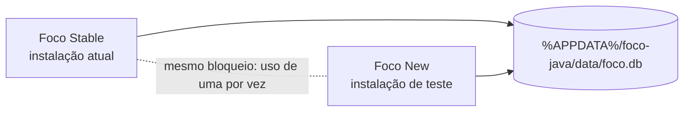

# Versões Stable e New

## Distribuição

- Stable preserva o instalador atual, identificado como versão 1.0.0.
- New é empacotada como `Foco-New-Setup-1.1.0.exe`, com atalhos próprios e instalação por usuário em `%LOCALAPPDATA%\Programs\foco-java`.
- Os instaladores usam identificadores Windows diferentes e os executáveis mantêm o nome interno `foco-java`, compartilhando o bloqueio de instância única e o caminho `%APPDATA%\foco-java\data`.
- O backend cria ou abre `foco.db` nesse diretório. A New adiciona `sessions.category` e `tasks.due_date` quando essas colunas ainda não existem.

## Compatibilidade dos dados

As alterações de esquema são aditivas. A categoria é `Normal` por padrão e o prazo pode permanecer nulo. A Stable ignora campos extras ao ler as linhas e não os remove ao atualizar suas colunas conhecidas. Assim, os registros seguem acessíveis nas duas versões. Antes de uma distribuição pública, validar a abertura alternada das duas instalações com uma cópia do banco real e fazer backup.

## Uso

Instale a New no diretório `%LOCALAPPDATA%\Programs\foco-java` e mantenha a Stable na pasta atual (`Foco`). Feche uma versão antes de iniciar a outra. A New não cria uma cópia isolada do banco: alterações feitas por ela também aparecem quando a Stable voltar a ser aberta.
