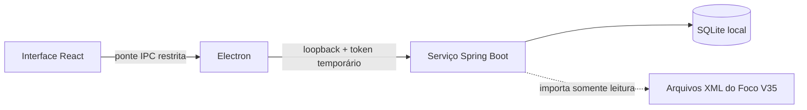

# Foco Java

<p align="center">
  <strong>Seu tempo de trabalho, organizado com privacidade e simplicidade.</strong><br>
  Uma aplicação desktop independente para registrar atividades, acompanhar tarefas e entender onde o tempo é investido.
</p>

<p align="center">
  
  
  
  
  
</p>

> **Versão Stable: 1.18.0.** Baixe o instalador na [release do GitHub](https://github.com/gmilanib/Foco/releases/tag/v1.18.0-stable). O Foco Java é uma aplicação desktop independente do Foco V35. Consulte o [roadmap](Roadmap.md) para as próximas melhorias.

## O que você pode fazer

- **Registrar seu foco:** use cronômetro ou timer, pause e retome sessões e continue acompanhando o tempo pela bandeja do sistema.
- **Organizar tarefas:** acompanhe tarefas pendentes, em andamento e concluídas, com prazos e vários apontamentos relacionados.
- **Planejar e revisar:** capture demandas em Tarefas e hoje, configure o limite de prioridades (padrão cinco), defina a próxima ação, compare estimativas com a capacidade diária e faça a revisão semanal.
- **Acompanhar avanços:** use checklists, arquive e restaure tarefas/projetos e configure modelos recorrentes com geração manual.
- **Consultar relatórios e dashboards:** filtre períodos e visualize o tempo por cliente, projeto, atividade ou consultor.
- **Corrigir ou recuperar registros:** edite lançamentos históricos, registre trabalho retroativo e importe dados do Foco V35 em modo somente leitura.
- **Personalizar seu espaço:** escolha tema, cor de destaque, cores de clientes e opções de privacidade para valores.
- **Manter seus dados locais:** os registros ficam em SQLite no computador; não é necessária uma conta ou um servidor externo.

## Como funciona



A interface conversa com o serviço Java apenas pela ponte segura do Electron. O serviço Spring escuta em `127.0.0.1` e exige um token local efêmero. Os XMLs da instalação original são lidos durante a importação e não são alterados.

## Começar a desenvolver

### Requisitos

- Windows 10 ou 11
- [Node.js 24](https://nodejs.org/) e npm
- Java 17 ou mais recente disponível no `PATH` (ou indique outro executável com `FOCO_JAVA`)

### Instalar dependências e iniciar

No PowerShell, a partir da pasta do projeto:

```powershell
npm ci
npm run dev
```

O comando de desenvolvimento compila o backend e inicia a interface e o Electron. A página de desenvolvimento fica em `http://127.0.0.1:5173`.

### Testar e gerar o instalador

```powershell
npm test
npm run build
npm run build:stable
```

Os testes incluem a suíte de integração Java e os testes da interface. `npm run build` produz o instalador New em `release/New`; `npm run build:stable` produz o instalador Stable em `release/Stable`. O computador que executar o aplicativo instalado precisa ter Java 17 ou mais recente. Encerre o apontamento e faça backup antes de atualizar; os canais compartilham o banco local.

## Dados e privacidade

O banco de dados fica em `%APPDATA%\foco-java\data\foco.db`. Para diagnóstico ou testes, `FOCO_DATA_DIR` permite escolher outro diretório. Faça backup dos dados antes de reinstalar ou mover o aplicativo; consulte o [manual](Doc/Manual.md) para os detalhes de uso e recuperação.

## Documentação

| Guia | Conteúdo |
|---|---|
| [Manual de uso](Doc/Manual.md) | Instalação, apontamentos, tarefas, relatórios, importação e backups |
| [Arquitetura](Doc/Arquitetura.md) | Processos, comunicação, endpoints e limites de confiança |
| [Entidades](Doc/Entidades.md) | Dados persistidos, relações e regras |
| [Casos de uso](Doc/Casos-de-uso.md) | Fluxos principais e alternativos |
| [Versões Stable e New](Doc/Versoes.md) | Compatibilidade, instalação lado a lado e atualização |
| [Roadmap](Roadmap.md) | Estado do projeto e próximos passos |

## Projeto de origem

O Foco Java é desenvolvido em pasta própria e não substitui nem modifica a instalação do Foco WPF. A importação dos dados do Foco V35 é opcional e somente leitura.

## Contribuições e licença

Ideias e relatos de problemas são bem-vindos. Antes de abrir uma contribuição, consulte o [roadmap](Roadmap.md) e descreva os passos para reproduzir o problema. A licença do projeto ainda precisa ser definida; até lá, não presuma permissão para redistribuir ou reutilizar o código.
